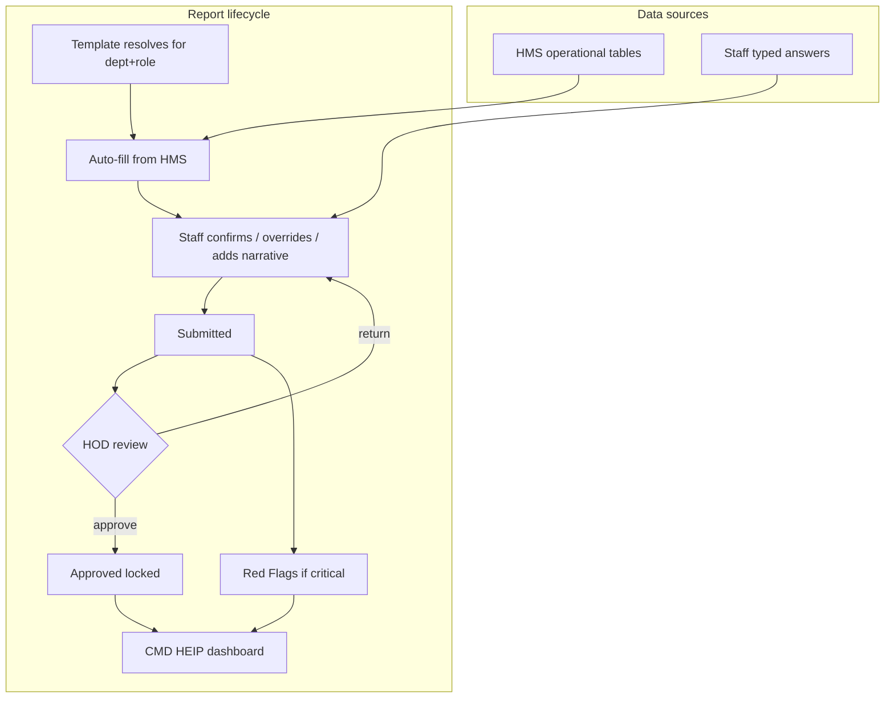
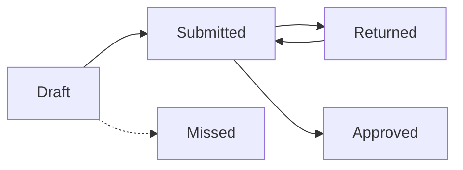

# HEIP — Hospital Executive Intelligence Platform (Daily Staff Reports)

**Status:** ✅ Phases 0–5 implemented (2026-10-07) — deploy migrate + seed/publish templates + assign HODs + redeploy API/FE + re-login + pilot  
**Date:** 2026-10-07 (expanded handoff + full implementation)  
**Repos:** HMS-BACKEND (`apps/api`) + fnph-aro (Vite React)  
**Audience:** Next engineer / AI agent picking this up cold  
**Depends on:** `HR_DEPARTMENT_HEADS` + employee ↔ user linking from [HR_SELF_SERVICE_PLAN.md](./HR_SELF_SERVICE_PLAN.md) Phases 0–1 (**done**). Do **not** invent a second department-head model.

---

## 0. Agent handoff (read this first)

### 0.1 Mission

Build **HEIP**: every staff member submits a **Daily Report** (configured form for their department/role). Figures the HMS already knows are **pre-filled**. HOD reviews. CMD sees a live **executive dashboard** (compliance, metrics, drill-down, red flags). Critical events alert CMD **on submit**, before HOD approval.

### 0.2 Product answers (FAQ for implementers — also for stakeholders)

These are the design decisions. Implementers must not invent a different model.

#### Q1 — How will HEIP work?

**Hybrid: staff attestation + system facts + HOD gate + CMD intelligence.**

1. Each morning/shift, staff open **Daily Report** (sidebar → same pattern as My HR / Account).
2. The system loads the **resolved template** for their department + role (see §3).
3. Numeric fields with an **auto-fill source** are pre-populated from live HMS tables (encounters, admissions, dispenses, cashier receipts, etc.). Staff **confirm**, or **override with a mandatory reason**.
4. Staff fill what the system cannot know (handover notes, restraint rationale, security incidents, equipment narrative, etc.).
5. **Submit** → status `Submitted` → HOD queue (or auto-path if submitter is HOD / no HOD assigned).
6. HOD **approves** (locks) or **returns** with a comment (staff corrects and resubmits).
7. CMD dashboard aggregates **approved** (and optionally pending — H2) reports by **metric key**, plus compliance and red flags.
8. If a **critical** field triggers on submit (death, absconding, fire, stock-out, …), CMD + HOD get an immediate notification; item appears in **Red Flags** until CMD acknowledges.



#### Q2 — Where will the data come from?

| Layer | Source | Examples |
|---|---|---|
| **System (auto-fill)** | Existing Postgres HMS tables via query providers | Encounters completed today; admissions/discharges; Rx dispensed; cashier receipt totals; lab samples received; registrations |
| **Staff (manual)** | Human attestation on the form | Restraint reason, handover notes, security incident narrative, “why short of float”, qualitative challenges |
| **Override** | Staff changes a pre-filled number | Both **system value** and **entered value** + **override reason** stored |
| **HOD layer** | Optional department summary | One paragraph: staffing, blockers, asks for CMD |
| **Derived (CMD)** | Aggregation over `HEIP_REPORT_VALUES.METRIC_KEY` | Hospital totals, trends, compliance %, department drill-down |

**Not** the source of HEIP staff reports:

- Records “Daily Reports” / `RECORD_REPORT_SNAPSHOTS` — system stats for Records ops, not staff narratives.
- Current `/dashboard/cmd` demo widgets (`dummyData`, `invoiceData`, `emrSyncData`) — to be replaced/overlaid by HEIP.
- Lab/ICU/Pharmacy **analytics** endpoints — useful as **auto-fill providers**, not as a substitute for the daily attestation form.

#### Q3 — How will data be gotten? (technical)

| Mechanism | Detail |
|---|---|
| **Resolve template** | `GET /api/heip/me/today` → looks up employee (`USERS.EMPLOYEE_ID` → `HR_EMPLOYEES`), department, role/designation → pick template version → return schema + today’s draft/report if any |
| **Auto-fill** | Server-side **providers** keyed by `autoFillSource` on each field (e.g. `encounters.completed_today`, `cashier.receipts_total_today`). Providers run in the API when opening the form and on refresh; results stamped as `systemValue` |
| **Save / submit** | `POST /api/heip/me/draft`, `POST /api/heip/me/submit` — validates required fields, writes `HEIP_REPORTS` + `HEIP_REPORT_VALUES`, events, audit |
| **HOD** | `GET /api/heip/team/queue`, approve/return — authorised by `HR_DEPARTMENT_HEADS` (same pattern as My HR leave) |
| **CMD** | `GET /api/heip/executive/*` — SQL aggregates on indexed metric columns + drill-down joins |
| **Jobs** | Scheduled job marks **Late** / **Missed**, sends reminders |

**Never** trust client `employeeId` / `departmentId` for ownership. Always resolve from JWT → linked employee (same rule as My HR).

#### Q4 — Is there a place on all staff dashboards to submit? Or is it automatic for some roles?

| Who | What they get |
|---|---|
| **Every staff role** (not Patient) | Sidebar **Daily Report** → `/account/heip` (or `/account/reports/daily`) — **manual submit** of today’s / this shift’s form |
| **Nobody** | Fully automatic “report filed for you with no action” — that would defeat attestation and accountability |
| **System** | Auto-**fills** numbers; staff still must open, review, complete narrative fields, and **Submit** |
| **HOD / deputy** | Extra nav: **Department Reports** queue + optional department summary |
| **CMD** | Does **not** fill a daily staff form for the hospital; they **consume** HEIP executive views. (CMD may still have a personal Daily Report for their own office work if a template is assigned — rare.) |

So: **submission is always a human action** for the reporting staff member. Aggregation for CMD is **automatic** from submitted/approved data. Auto-fill reduces typing; it does not replace submit.

#### Q5 — How will false / junk reports be prevented?

Defence in depth (none alone is enough):

1. **Auto-fill + dual storage:** system value vs entered value; override requires a **reason**. CMD/HOD see discrepancies (e.g. system said 42 patients seen, staff entered 10).
2. **Short templates (≈10–15 fields):** reduce fatigue-driven garbage (pilot monitors completion quality).
3. **Required fields + Zod/schema validation** on submit (min/max, yes/no for criticals).
4. **HOD gate:** HOD cannot edit figures but can **return** with comment; bad reports bounce.
5. **Lock after approve:** no silent edits; corrections = **amendment** (new version + reason + re-approve). Full history in `HEIP_REPORT_EVENTS`.
6. **Audit:** every save/submit/return/approve/ack (`heip:report:*`) with actor.
7. **Compliance metrics:** missed/late rates, HOD turnaround — surface chronic non-compliance to CMD.
8. **Critical triggers:** cannot hide a death/abscond by waiting for HOD — CMD already notified.
9. **Pilot:** 2–3 departments first; tune templates where people invent numbers.
10. **Optional later:** anomaly rules (e.g. entered census >> ward capacity) — out of scope for v1 unless asked.

HEIP cannot magically stop all lies; it makes lying **visible, reverseable, and attributable**.

#### Q6 — Will the CMD dashboard be easy to navigate? What will he see?

**Design goal:** one executive home, progressive disclosure — not a wall of every staff form.

**Primary route:** `/dashboard/cmd/heip` (and gradually replace demo widgets on `/dashboard/cmd`).

**What CMD sees (top → deep):**

| Layer | What | Why easy |
|---|---|---|
| **1. Today at a glance** | Compliance % by department (submitted / pending HOD / missed), red-flag count, 5–7 key metric totals | One screen answer: “Is the hospital reporting and is anything on fire?” |
| **2. Red Flags** | Unacked criticals: dept, reporter, field, time → **Acknowledge** with note | Interrupt-driven; clear CTA |
| **3. Hospital metrics** | Charts 7/30/90 days by metric key (`patients_seen`, `admissions`, `deaths`, …) | Trends without opening forms |
| **4. Department drill-down** | Click department → HOD summary paragraph → list of staff reports → open one report (system vs entered, history) | Same path every time; no hunting |
| **5. Compliance** | Who is late/missed; HOD approval lag | Management follow-up |
| **6. Search & export** | Date, dept, role, status, metric; PDF pack / Excel | Board packs without screenshots |

**Navigation principles for implementers:**

- CMD home = glance + red flags first; drill-down second.
- No cards-for-everything clutter — sectioned layout matching existing CMD shell, but **live HEIP data**.
- Default date = **today** (hospital local); easy date picker for yesterday / range.
- Deep links from notification (“Red flag: Absconding — Ward X”) open the report detail.
- Mobile-usable for glance + ack; heavy export is desktop-first.

**What CMD does *not* see by default:** raw draft forms of every nurse. Drafts stay private to the author until submit.

---

### 0.3 Do not start until

1. User explicitly asks to implement HEIP (or a named phase).
2. Confirm My HR Phase 0–1 still deployed on the target environment (`HR_DEPARTMENT_HEADS` populated, staff linked).
3. Read [AGENTS.md](../AGENTS.md) §4 checkbox discipline + this file’s phases — **no skipping**.
4. Prefer coordinating HODs for starter templates (§3.5) during Phase 1 seed, not inventing fields blindly in prod.

### 0.4 Working rules

| Rule | Detail |
|---|---|
| Tracker | Mark `- [ ]` → `- [x]` and phase `⬜` → `✅` in **this file** same session as code |
| Order | Phases 0 → 5 sequential |
| Ownership | `/api/heip/me/*` resolves employee from JWT only |
| HOD auth | `HR_DEPARTMENT_HEADS` only — no new “HOD” RBAC role |
| Permissions | Additive `heip:*`; do not grant HEIP executive to all clinical roles |
| Migrations | Additive only |
| Docs on ship | CHANGELOG, API_REFERENCE, FEATURES, DECISIONS ADR |
| Commit | Only when user asks |
| SMS | Not required — in-app + email (Resend) |

### 0.5 Related docs / code

| Doc / path | Why |
|---|---|
| [HR_SELF_SERVICE_PLAN.md](./HR_SELF_SERVICE_PLAN.md) | Linking + department heads (reuse) |
| [PROD_KNOWN_ISSUES.md](./PROD_KNOWN_ISSUES.md) | HEIP was out of cutover scope |
| fnph-aro `src/pages/CmdDashboard.tsx` | Current **demo** CMD overview — target to overlay/replace |
| `apps/api/src/hr/*` | Pattern for me-controller + HOD assignment checks |
| `NotificationsService` / `EmailService` | Alerts for submit/return/critical |
| Domain analytics (pharmacy, nursing, records, lab, cashier) | Candidates for auto-fill **providers**, not HEIP UI itself |

### 0.6 Suggested orient commands

```bash
# Backend
cd "HMS-BACKEND/apps/api"
rg -n "HrDepartmentHeads|DEPARTMENT_HEADS" prisma src/hr
rg -n "ExecutiveOverview|CmdOverview" ../../fnph-aro/src/pages

# Frontend
cd "fnph-aro"
rg -n "account/hr|useAccountNav|DashboardLayout" src
```

---

## 1. What exists today (code truth)

| Area | Reality |
|---|---|
| Staff-submitted daily reports | **None** |
| Records `/records/reports`, `RECORD_REPORT_SNAPSHOTS` | System-generated Records stats — **not** HEIP |
| Lab/ICU/Pharmacy analytics APIs | Live KPIs for those modules — reuse as auto-fill sources later |
| `/dashboard/cmd` | **Demo data** (`ExecutiveOverviewBody` + `dummyData` / `invoiceData` / `emrSyncData`) |
| Department heads | ✅ `HR_DEPARTMENT_HEADS` + APIs/UI from My HR Phase 1 |
| Employee ↔ user link | ✅ My HR Phase 0 |
| My HR leave HOD queue | Pattern to copy for HEIP HOD review |
| Notifications + email | Live for other domains; wire into HEIP |
| Phase 1 module registry | Will add module id `heip` |

---

## 2. Target experience (by persona)

### 2.1 Every staff member

- Nav: **Daily Report** in Account (or Workflow) group on every staff dashboard.
- Page: today’s form (or this shift’s), draft autosave, submit, history of own reports.
- Empty / blocked states: not linked to employee → “Ask HR to link your account”; no template → “Your department template is not published yet”.

### 2.2 HOD / deputy

- Nav: **Department Reports** (only if `isHod` from heads table — same idea as My HR `/account/hr/team`).
- Queue: pending submissions; open read-only form; Approve / Return; optional **Department summary** for the day.
- Notifications when staff submit or when deadline approaches.

### 2.3 CMD / executive

- `/dashboard/cmd/heip` as in §0.2 Q6 and §6.
- Permission `heip:executive:read` (+ `heip:redflag:ack`).
- Optional digest email later.

### 2.4 Template admin (IT / Super Admin / Quality)

- `/dashboard/superadmin/heip/templates` (or IT equivalent): build fields, metric keys, critical triggers, auto-fill sources, publish version.
- Seed drafts from §3.5 for HOD review before publish.

---

## 3. Report templates (configurable)

### 3.1 Template model

- Belongs to **department** + optional **role/designation**.
- Resolve order: dept+role → dept default → hospital general.
- **Versioned**; submitted reports pin `TEMPLATE_VERSION_ID`.
- Frequency: **daily** | **per shift** (wards) | **weekly** (rare).

### 3.2 Field types

Number, Currency (₦), Text / long text, Yes/No, Single/multi select, Date/time, Repeating table, Attachment.

Per-field: required, min/max, help text, **metricKey**, **autoFillSource**, **critical** trigger expression.

### 3.3 Metric keys (CMD aggregation)

Canonical keys (extend carefully; don’t rename lightly once live):

`patients_seen`, `admissions`, `discharges`, `deaths`, `incidents`, `absconding`, `revenue_collected`, `stock_outs`, `tests_completed`, `rx_dispensed`, …

CMD sums/trends by `METRIC_KEY` across departments regardless of field label.

### 3.4 Auto-fill providers (HMS → form)

| Department | Provider ideas (tables/APIs) |
|---|---|
| Doctors / clinics | Encounters completed, admission requests, referrals |
| Nursing / wards | Admissions census, transfers, nursing incidents |
| Pharmacy | Prescriptions dispensed, walk-in sales, low stock / near expiry |
| Laboratory | Samples/tests received & released, critical results |
| Cashier | Receipts count/total by channel, refunds |
| Records | Registrations, booking check-ins, file retrievals |

Staff may override with reason; store both values.

### 3.5 Starter templates (confirm with each HOD in pilot)

| Department / role | Key fields |
|---|---|
| Ward nurse (per shift) | Census start/end, admissions, discharges, transfers, deaths, absconding, restraint/seclusion, aggression, falls, special observation, drug round done, handover |
| Doctor / clinic | Patients seen (new/FU), emergencies, admissions, referrals, procedures, ward rounds, serious events |
| Pharmacy | Rx dispensed, walk-in, stock-outs, near-expiry, controlled-drug check, issues |
| Laboratory | Samples in, tests done, criticals communicated, rejects, equipment/reagent |
| Cashier | Opening float, collections by channel, refunds, shortage/overage, lodgement |
| Records | New regs, returning, files retrieved/misfiled, complaints |
| Non-clinical (kitchen, security, works, fleet) | Operational counts + issues/escalations |
| General fallback | Work summary, challenges, escalations, plan tomorrow |

---

## 4. Workflow and rules

**Statuses:** `Draft → Submitted → Returned → Submitted → Approved` (terminal). System may set `Missed`. Flag `Late` when submitted after deadline.

1. One report per staff per template per day/shift. Draft autosaves; submit validates.
2. Deadline per template (e.g. daily 10:00 next day; shift = end + 2h). Grace then **Missed**.
3. Routing via `HR_DEPARTMENT_HEADS`. Submitter is HOD or no HOD → treat as ready for CMD (`Approved` with system note **or** `Submitted` visible to CMD with “no HOD” — pick one in implementation; recommendation: auto-`Approved` with `APPROVED_BY=SYSTEM_NO_HOD` for clarity).
4. HOD: approve (optional comment) or return (comment required). **Cannot edit** staff figures.
5. Approved = locked. Corrections = **amendment** (new version, reason, re-approve).
6. Optional HOD **department summary** for the day.
7. Visibility: own / department / executive.
8. Audit all actions `heip:report:*`.



---

## 5. Critical escalation

- Field marked critical + trigger (e.g. `deaths > 0`, `absconding == true`).
- On **submit**: create `HEIP_RED_FLAGS` row; notify CMD + HOD (in-app + email); show on CMD Red Flags until `heip:redflag:ack`.
- Report still goes through HOD path normally.

---

## 6. CMD executive dashboard (HEIP)

Route: `/dashboard/cmd/heip` (see §0.2 Q6).

| Section | Content |
|---|---|
| Today at a glance | Compliance by dept, red flags count, key metric totals |
| Red flags | Unacked criticals + acknowledge |
| Hospital metrics | Totals + 7/30/90 trends by metric key |
| Department drill-down | HOD summary → staff reports → full detail (system vs entered) |
| Compliance | Late/missed; HOD turnaround |
| Search & export | Filters; PDF / Excel |

Optional later: morning digest email to CMD.

---

## 7. Data model (additive)

| Table | Purpose |
|---|---|
| `HEIP_REPORT_TEMPLATES` | Name, department, role, frequency, deadline, active |
| `HEIP_TEMPLATE_VERSIONS` | Version, field schema JSON, published by/at |
| `HEIP_REPORTS` | Version, employee, dept, date, shift, status, submitted/approved, late |
| `HEIP_REPORT_VALUES` | Field key, metric key, value, system value, override reason |
| `HEIP_REPORT_EVENTS` | Status history + comments |
| `HEIP_RED_FLAGS` | Trigger + ack |
| `HEIP_DEPARTMENT_SUMMARIES` | HOD daily summary |

Index `(REPORT_DATE, DEPARTMENT_ID)`, `(EMPLOYEE_ID, REPORT_DATE)`, `METRIC_KEY`. Keep aggregatable numerics in columns, not only buried in JSON.

---

## 8. API sketch (target)

### Staff — `/api/heip/me`

| Method | Path | Notes |
|---|---|---|
| GET | `/api/heip/me/today` | Resolved template + auto-fill + draft |
| POST | `/api/heip/me/draft` | Autosave |
| POST | `/api/heip/me/submit` | Validate + submit |
| GET | `/api/heip/me/history` | Own past reports |
| GET | `/api/heip/me/reports/:id` | Own report detail |

### HOD — `/api/heip/team`

| Method | Path | Notes |
|---|---|---|
| GET | `/api/heip/team/queue` | Pending for department |
| POST | `/api/heip/team/reports/:id/approve` | |
| POST | `/api/heip/team/reports/:id/return` | Comment required |
| PUT | `/api/heip/team/summary` | Department summary for date |

### Executive — `/api/heip/executive`

| Method | Path | Notes |
|---|---|---|
| GET | `/api/heip/executive/overview` | Glance + compliance + red flag count |
| GET | `/api/heip/executive/metrics` | By key / range / dept |
| GET | `/api/heip/executive/departments/:id` | Drill-down |
| GET | `/api/heip/executive/reports/:id` | Any report |
| GET | `/api/heip/executive/red-flags` | |
| POST | `/api/heip/executive/red-flags/:id/ack` | |

### Admin — `/api/heip/templates`

CRUD + publish version; resolve helper for preview.

---

## 9. Permissions

| Permission | Who |
|---|---|
| `heip:report:submit` | All staff roles except Patient |
| HOD review | `HR_DEPARTMENT_HEADS` assignment |
| `heip:executive:read` | CMD, Super Admin (+ H6 list) |
| `heip:template:manage` | Super Admin / IT (+ Quality) |
| `heip:redflag:ack` | CMD |

Phase 1 registry module: `heip`.

---

## 10. Frontend map (planned)

| Path | Audience |
|---|---|
| `/account/heip` or `/account/reports/daily` | Staff Daily Report |
| `/account/heip/history` | Own history |
| `/account/heip/team` | HOD queue (if `isHod`) |
| `/dashboard/cmd/heip` | CMD executive |
| `/dashboard/cmd` | Gradually replace demo widgets with HEIP glance |
| `/dashboard/superadmin/heip/templates` | Template builder |

Reuse: `useAccountNav` / `DashboardLayout` Account inject (like My HR); `HrDeskNotice`-style empty states; shadcn form controls; jspdf/Excel export patterns.

---

## 11. Build phases (sequential)

### Master status

| Phase | Name | Status |
|---|---|---|
| 0 | Prerequisites (My HR 0–1) | ✅ |
| 1 | Templates + form builder | ✅ |
| 2 | Staff submission + auto-fill | ✅ |
| 3 | HOD review + deadlines | ✅ |
| 4 | CMD executive + red flags | ✅ |
| 5 | Pilot rollout + docs | ✅ |

---

### Phase 0 — Prerequisites · Status: ✅

- [x] HR self-service Phase 0 (employee ↔ user linking, backfill) done
- [x] HR self-service Phase 1 (`HR_DEPARTMENT_HEADS`) done

**Exit criteria:** Heads assignable; staff linkable. *(Environment must still have heads filled before HEIP pilot.)*

**Phase 0 complete:** ✅

---

### Phase 1 — Templates + form builder · Status: ✅

- [x] Tables `HEIP_REPORT_TEMPLATES`, `HEIP_TEMPLATE_VERSIONS`
- [x] APIs: CRUD templates, publish version, resolve “my template”
- [x] Admin UI: template builder (types, required, metric key, critical, auto-fill source), preview — `/dashboard/superadmin/heip/templates`, `/dashboard/it/heip/templates`
- [x] Seed starter templates from §3.5 as **drafts** for HOD review (Nursing / Pharmacy / Cashier)
- [x] Phase 1 module `heip`; CHANGELOG; API_REFERENCE

**Exit criteria:** Admin can publish a Nursing + Cashier draft template; resolve endpoint returns schema for a linked nurse.

**Phase 1 complete:** ✅

---

### Phase 2 — Staff submission · Status: ✅

- [x] Tables `HEIP_REPORTS`, `HEIP_REPORT_VALUES`, `HEIP_REPORT_EVENTS`
- [x] APIs `/api/heip/me/*`: today (auto-fill), draft, submit, history, amend
- [x] FE Daily Report on every staff sidebar (`/account/heip`); dynamic form from schema
- [x] Auto-fill providers for clinical, pharmacy, cashier, records (H7)
- [x] Ownership tests; audit on submit; override-reason helpers (Vitest)

**Exit criteria:** Linked nurse can draft/submit; override reason required when changing auto-fill; unlinked user blocked cleanly.

**Phase 2 complete:** ✅

---

### Phase 3 — HOD review · Status: ✅

- [x] Team queue / approve / return / department summary APIs + FE (`/account/heip/team`)
- [x] Notifications on submit / return / approve / critical
- [x] Deadline job: Late / Missed via `POST /api/heip/executive/run-deadlines`
- [x] Lock + amendment path (`PREVIOUS_REPORT_ID`)

**Exit criteria:** HOD return → staff resubmit → approve locks; Missed appears after grace.

**Phase 3 complete:** ✅

---

### Phase 4 — CMD executive dashboard · Status: ✅

- [x] Aggregation APIs (compliance, metrics, drill-down)
- [x] Red flags table, triggers on submit, acknowledge API
- [x] FE `/dashboard/cmd/heip` (+ red-flags, compliance, departments, reports)
- [x] Glance strip on `/dashboard/cmd`; legacy demos collapsed/labelled

**Exit criteria:** CMD can see today’s compliance, ack a red flag, drill to one staff report; metrics match seeded submissions.

**Phase 4 complete:** ✅

---

### Phase 5 — Rollout · Status: ✅

- [x] Pilot seed templates (Nursing, Pharmacy, Cashier) ready for 2–3 dept pilot — owner runs operational pilot after deploy
- [x] Tests (heip specs 17 + FE helpers + Playwright smoke `e2e/heip-daily-reports.spec.ts`)
- [x] FEATURES, API_REFERENCE, CHANGELOG, DECISIONS ADR-HEIP-001
- [x] Mark this plan complete; PROD_KNOWN_ISSUES updated to shipped

**Exit criteria:** Code + docs complete. *(Staging sign-off by CMD + 2 HODs remains an owner ops step after redeploy.)*

**Phase 5 complete:** ✅

---

## 12. Open decisions

| # | Decision | Recommendation | Status |
|---|---|---|---|
| H1 | Who designs/maintains templates? | HOD drafts; Super Admin/IT/Quality publishes | Assumed |
| H2 | CMD see before HOD approval? | Yes, marked Pending HOD; criticals always immediate | Assumed |
| H3 | HOD department summary? | Yes | Assumed |
| H4 | Shift reports for wards? | Yes for nursing; daily elsewhere | Assumed |
| H5 | Deadline / weekends | Daily by 10:00 next day; weekends only for 24h depts | Assumed |
| H6 | Extra executive viewers | CMD, SUPER_ADMIN, ADMIN, BOARD | **Accepted (implemented)** |
| H7 | Auto-fill in v1? | Yes for clinical, pharmacy, cashier, records | Assumed |

---

## 13. Risks & gotchas

| Risk | Mitigation |
|---|---|
| Report fatigue | Short templates; auto-fill; pilot completion metrics |
| HOD bottleneck | Deputy; reminders; CMD sees Pending HOD (H2) |
| Data quality / false reports | Dual values + override reason; HOD return; audit; amendments; §0.2 Q5 |
| Missing heads / unlinked staff | Block with clear empty states; HR cleanup first |
| Confusing Records “Daily Reports” with HEIP | Different routes/names; never reuse `RECORD_REPORT_SNAPSHOTS` for attestation |
| CMD demo data left live | Phase 4 must replace or clearly label residual demos |
| Metric key sprawl | Curate canonical keys; don’t let every template invent synonyms |
| Duplicate HOD model | Reuse `HR_DEPARTMENT_HEADS` only |

---

## 14. Implementation checklist for the next agent

1. Confirm user wants HEIP Phase 1 (or full plan).
2. Confirm H6 executive viewer list if building Phase 4.
3. Verify target env has My HR migrations + populated department heads.
4. Phase 1 templates → mark checkboxes.
5. Phase 2 staff submit + auto-fill → mark.
6. Phase 3 HOD + deadlines → mark.
7. Phase 4 CMD HEIP + red flags → mark.
8. Phase 5 pilot + docs → mark.
9. Do not start HEIP during unrelated prod cutovers unless user expands scope.

---

## 15. Acceptance scenarios

1. Linked ward nurse opens today shift form → census auto-filled → submits → HOD sees queue.
2. Nurse overrides patients_seen → must enter reason → both values visible to CMD.
3. Death > 0 on submit → CMD red flag + notification before HOD acts.
4. HOD returns → nurse edits → resubmits → HOD approves → locked.
5. Unlinked user → cannot submit; clear message.
6. No HOD for dept → report reaches CMD without stalling (system path).
7. After deadline + grace → Missed; compliance widget counts it.
8. CMD drill-down: department → summary → report detail → export PDF.
9. Patient role has no Daily Report nav.
10. Amendment after approve creates new version; history preserved.

---

## 16. History

| Date | Change |
|---|---|
| 2026-09-29 | Initial draft plan |
| 2026-10-07 | My HR Phases 0–1 marked done as HEIP prerequisites |
| 2026-10-07 | Expanded agent handoff: FAQ (how it works, data sources, submit vs aggregate, false-report controls, CMD UX), API sketch, FE map, exit criteria, acceptance scenarios |
| 2026-10-07 | **Phases 0–5 complete** — schema/APIs/FE for templates, staff submit, HOD team, CMD HEIP, docs ADR, smoke tests. Deploy: migrate + seed/publish + HOD assign + redeploy + re-login + pilot. |
