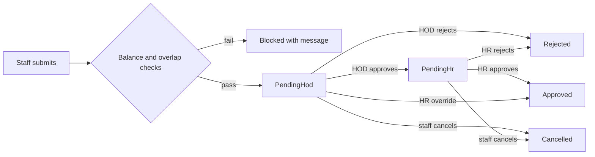

# HR Staff Self-Service Plan (My HR)

**Status:** ✅ Phases 0–5 implemented (2026-10-07) — deploy migrations + backfill + redeploy API/FE + staff re-login  
**Date:** 2026-10-07 (expanded handoff + full implementation)  
**Repos:** HMS-BACKEND (`apps/api`) + fnph-aro (Vite React)  
**Audience:** Next engineer / AI agent picking this up cold  
**Decisions taken:** Leave approval chain is **Staff → Head of Department (HOD) → HR**. Self-service scope: leave, attendance, KPI/appraisal, payslips, own contact details.

---

## 0. Agent handoff (read this first)

### 0.1 Mission

Build **My HR**: every authenticated staff user (not Patient) can view and act on **their own** HR data under `/account/hr/*`, with leave going through **HOD then HR**. Do **not** expose the existing `/api/hr/*` admin APIs to ordinary staff.

### 0.2 Do not start until

1. User explicitly asks to implement this plan (or a named phase). Prod cutover Phases A–E are separate — see [PROD_KNOWN_ISSUES.md](./PROD_KNOWN_ISSUES.md) § “Out of scope”.
2. You have read [AGENTS.md](../AGENTS.md) §4 (checkbox discipline) and `.cursor/rules/general.mdc` + `docs-trackers.mdc`.
3. You understand HEIP ([HEIP_DAILY_REPORTS_PLAN.md](./HEIP_DAILY_REPORTS_PLAN.md)) **depends on Phases 0–1** of this plan (`HR_DEPARTMENT_HEADS` + employee↔user linking). Do not invent a second department-head model for HEIP.

### 0.3 Working rules for implementers

| Rule | Detail |
|---|---|
| Tracker | Mark `- [ ]` → `- [x]` and phase `⬜` → `✅` in **this file** in the same session as the code. |
| Order | Phases 0 → 5 sequential. Do not skip. Exit criteria must pass before the next phase. |
| Ownership | Every `/api/me/hr/*` handler resolves the employee from the JWT user — **never** trust client `employeeId`. |
| Permissions | Add `hr:self:*` for staff. Keep existing `hr:*` for HR desk. Do not grant `HR_CORE_PERMISSIONS` to clinical roles. |
| Migrations | Additive only. Never edit applied migrations. Use `@@map` / snake tables already used by HR. |
| Docs on ship | Update `CHANGELOG.md`, `API_REFERENCE.md`, `FEATURES.md`, and add a DECISIONS ADR for the HOD→HR chain when Phase 2+ lands. |
| Commit | Only when the user asks. |
| SMS | Not required. Notifications = in-app `NOTIFICATIONS` + email via existing `EmailService` / Resend when configured. |

### 0.4 Suggested first commands (orient)

```bash
# Backend
cd "HMS-BACKEND/apps/api"
rg -n "HrLeaveRequests|actorEmployeeId|createLeave|approveLeave" src/hr
rg -n "HR_CORE_PERMISSIONS|hr:leave" src/common/constants/permissions.constants.ts
# Schema
rg -n "model Hr" prisma/models/hr.prisma

# Frontend
cd "fnph-aro"
rg -n "HrDeskNotice|/dashboard/hr|api/hr" src
rg -n "useAccountNav|/account/" src/pages/account src/lib
```

### 0.5 Related docs

| Doc | Why |
|---|---|
| [PROD_KNOWN_ISSUES.md](./PROD_KNOWN_ISSUES.md) | FX-13 replaced mock leave/attendance with `HrDeskNotice`; My HR explicitly out of that deploy |
| [HEIP_DAILY_REPORTS_PLAN.md](./HEIP_DAILY_REPORTS_PLAN.md) | Needs `HR_DEPARTMENT_HEADS` from Phase 1 |
| [FEATURES.md](./FEATURES.md) | HR desk already marked live (`/api/hr/*`) |
| [CHANGELOG.md](./CHANGELOG.md) | Seed note: `hr@` linked to `FNPH-HR-001` |
| fnph-aro `AGENTS.md` / HMS `AGENTS.md` | Checkbox + module conventions |

---

## 1. What exists today (code truth)

### 1.1 Backend module map

| Path | Role |
|---|---|
| `apps/api/src/hr/hr.module.ts` | Registers `HrController`, `StaffController`, `StudentsController`, `HrService`; imports `AuditModule` only (no Notifications yet) |
| `apps/api/src/hr/hr.controller.ts` | `@Controller('hr')` — all routes behind `JwtAuthGuard` + `PermissionsGuard` + `hr:*` |
| `apps/api/src/hr/hr.service.ts` | All business logic (~1700+ lines). Key helpers: `actorEmployeeId`, `canSelfApproveLeave`, `createLeave`, `approveLeave`, `applyOnLeaveIfInRange` |
| `apps/api/src/hr/dto/hr.dto.ts` | DTOs; leave type **string enum** `HR_LEAVE_TYPES` = Annual/Sick/Maternity/Casual/Study/Other (parallel to DB table) |
| `apps/api/prisma/models/hr.prisma` | Tables `HR_EMPLOYEES`, `HR_LEAVE_TYPES`, `HR_ATTENDANCE`, `HR_LEAVE_REQUESTS`, `HR_APPRAISALS`, `HR_DISCIPLINARY`, `HR_DOCUMENTS`, `HR_PAYROLL_*` |
| `apps/api/prisma/models/users.prisma` | `USERS.EMPLOYEE_ID Int?` — **no FK** to `HR_EMPLOYEES` |
| `apps/api/prisma/models/service-catalog.prisma` | Billing `DEPARTMENTS` — reuse IDs for employee `DEPARTMENT_ID`; **do not** alter this table for HOD |
| `apps/api/prisma/migrations/20260916120000_hr_modules_phases_a_e/` | Created HR tables + seeded leave types |
| `apps/api/prisma/seed.ts` → `seedHrDemoEmployees()` | Creates `FNPH-HR-001` (linked both ways for `hr@`), plus demo nurse/doctor employees **without** user links |
| `apps/api/src/common/constants/permissions.constants.ts` | `HR_CORE_PERMISSIONS` granted to `ROLES.HR` + full-access roles only |
| `apps/api/src/notifications/notifications.service.ts` | `createForUser` pattern (used by transfers) — **reuse for leave step alerts** |
| `apps/api/src/notifications/email.service.ts` | Resend email — optional second channel for leave decisions |

**There is no `/api/me/*` controller yet.** Self-service should be a **new** controller (e.g. `me-hr.controller.ts`) under a clear prefix, not bolted onto `HrController` with weaker guards.

### 1.2 HR-side (working, live API)

| Area | Backend | HR dashboard page |
|---|---|---|
| Employee records | `GET/POST/PATCH /api/hr/employees`, deactivate/reactivate | `/dashboard/hr/staff` ✅ live |
| Attendance | `GET/POST/PATCH /api/hr/attendance` (HR records it) | `/dashboard/hr/attendance` ✅ live |
| Leave | `GET/POST/PATCH /api/hr/leave-requests`, `approve`, `reject` | `/dashboard/hr/leave` ✅ live |
| Appraisals | `GET/POST/PATCH /api/hr/appraisals` (4 scores + band, Draft/Final) | `/dashboard/hr/performance` ✅ live |
| Disciplinary / documents | `/api/hr/disciplinary`, `/api/hr/documents` | `/dashboard/hr/compliance` ✅ live |
| Payroll | runs per month, edit lines, lock (immutable) | `/dashboard/hr/payroll` ✅ live |
| Support tickets | `POST/GET/PATCH /api/support-requests` | Header Support + `/dashboard/hr/support` ✅ live |
| Leave types | Table seeded: ANNUAL 30, SICK 15, MATERNITY 90, CASUAL 7, STUDY 10, OTHER 0 | ❌ **no list/update API** |
| KPIs page | — | `/dashboard/hr/kpis` ❌ **mock** (`staffKpis` from `workflowData`) |

### 1.3 Leave behaviour today (important for migration)

From `hr.service.ts`:

- **Create:** If caller lacks leave-approve permission, `employeeId` is forced from `USERS.EMPLOYEE_ID` via `actorEmployeeId`. If null → `403 Your user account is not linked to an employee record`. HR with approve perms must pass `employeeId`.
- **Status:** only `Pending | Approved | Rejected | Cancelled`. Approve/reject require `STATUS === 'Pending'`.
- **Days:** client-supplied `dto.days` — **not** computed.
- **Balances / overlap / holidays:** **none**.
- **Self-approve block:** cannot approve own leave unless Super Admin / Admin / CMD (`canSelfApproveLeave`).
- **On approve:** if leave covers today → employee `STATUS = OnLeave`. Does **not** currently write attendance `OnLeave` rows (plan says add that).
- **Audit:** `hr:leave:create|update|approve|reject` via `AuditService`.
- **In-app notify:** **not** wired for leave yet.

### 1.4 Staff-side (the gap)

- Ordinary roles (Doctor, Nurse, Cashier, Records, …) get **403** on every `/api/hr/*` endpoint — they lack `HR_CORE_PERMISSIONS`.
- Non-HR dashboards previously had mock `LeaveRequestPanel` / `AttendancePanel`. **Prod cutover FX-13** replaced them with `fnph-aro/src/components/workflow/HrDeskNotice.tsx` on Staff / Finance / Doctor leave & attendance routes. Copy says “use the HR desk”; link goes to `/account/profile`.
- **Linking bug (blocker for self-service):**
  - Identity for “my leave” uses **`USERS.EMPLOYEE_ID`**.
  - `createEmployee` / `updateEmployee` only set **`HR_EMPLOYEES.USER_ID`**.
  - They **do not** write back `USERS.EMPLOYEE_ID`.
  - Seed is the exception: `hr@fnpharo.gov.ng` ↔ `FNPH-HR-001` linked both ways.
  - Most migrated staff: exist in `USERS` (phone + PIN) with `EMPLOYEE_ID = null` and often **no** `HR_EMPLOYEES` row.

### 1.5 Frontend map (fnph-aro)

| Path | Notes |
|---|---|
| `src/lib/api/hr.ts` | Typed client for **HR desk** `/api/hr/*` — keep for HR role; add **new** `src/lib/api/hrSelf.ts` for `/api/me/hr/*` |
| `src/pages/HrDashboard.tsx` | Large file: live staff/leave/attendance/payroll + **mock KPIs**; leave create/approve mutations already use API |
| `src/pages/account/AccountPages.tsx` | `useAccountNav()` merges role nav + Profile/Settings — **copy this pattern** for My HR pages |
| `src/lib/accountNav.tsx` / `src/lib/dashboardNav.ts` | Canonical role sidebars; Account group injects Profile/Settings |
| `src/components/DashboardLayout.tsx` | Injects My Profile / Settings into every dashboard |
| `src/App.tsx` | `/account/profile`, `/account/settings`; `/dashboard/hr/*` behind `RequireRole` `HR_ROLES` |
| `src/lib/phase1/modules.ts` | Phase 1 module gates — `/account/hr/*` must be allowed (core account, not blocked) |
| `src/components/workflow/HrDeskNotice.tsx` | Placeholder until Phase 4; then swap to live My HR links |

### 1.6 Seed / demo credentials relevant to testing

- `hr@fnpharo.gov.ng` — HR role, employee `FNPH-HR-001`, **both** links set (good for HR desk + later self-service as HR employee).
- Demo employees `FNPH-NUR-001`, `FNPH-DOC-001` — **no** `USER_ID` / no matching staff login link by default.
- After Phase 0 backfill, expect to link real staff users; until then local tests need a manually linked nurse/doctor user.

---

## 2. Target experience

### 2.1 For every staff member — "My HR"

A **My HR** entry in every **staff** role’s sidebar Account group (next to My Profile / Settings). Use the same nav pattern as `/account/profile` (`useAccountNav` / `DashboardLayout` account inject). **Exclude** Patient portal role.

| Page | What staff can do |
|---|---|
| `/account/hr` Overview | Leave balances per type, pending requests, this month's attendance summary, latest Final KPI, latest locked payslip; flag `isHod` if applicable |
| `/account/hr/leave` | Apply (type, dates, reason; **days server-computed**), balances, status + who acted, cancel while `PendingHod` or `PendingHr` |
| `/account/hr/attendance` | Own history + monthly summary (Present / Late / Absent / OnLeave) |
| `/account/hr/performance` | Own **Final** appraisals only |
| `/account/hr/payslips` | Own lines from **Locked** payroll runs; view + PDF (jspdf, same idea as certificates) |
| `/account/hr/details` | View employee record; edit phone, email, next of kin (+phone), emergency contact (+phone) only |

### 2.2 For Heads of Department — "Team Approvals"

Shown only when `summary.isHod` (or deputy) is true — driven by `HR_DEPARTMENT_HEADS`, **not** by a new RBAC role:

- `/account/hr/team` — pending leave for their department; requester balance; who else is off on those dates.
- Approve → `PendingHr`; Reject → `Rejected` + reason.

### 2.3 For HR

- `/dashboard/hr/leave`: stage filters **Awaiting HOD** / **Awaiting HR** / Approved / Rejected / Cancelled.
- Final approve only from `PendingHr`.
- **Override** any `PendingHod` with mandatory note → audit `hr:leave:override`.
- New setup: **Department Heads**, **Leave Types & Entitlements** (and holidays if D3 = yes).
- `/dashboard/hr/kpis` → live appraisals (replace `staffKpis` mock).

---

## 3. Leave approval flow



**Rules**

1. **Days computed server-side** from start/end: working days Mon–Fri, minus public holidays (D3). Client may send a hint; server overwrites `DAYS`.
2. **Balance:** requested ≤ `DAYS_PER_YEAR − approved − pending` for that type in the leave year (D2 = calendar year). Types with `DAYS_PER_YEAR = 0` skip balance but still need approval.
3. **Overlap:** no two non-cancelled/non-rejected requests may share a calendar day for the same employee.
4. **Routing:** HOD of employee’s `DEPARTMENT_ID`. No HOD assigned, or requester **is** the HOD/deputy → skip to `PendingHr` (D1).
5. **No self-approval** at HOD or HR stage (existing Super Admin/Admin/CMD exception for HR stage only).
6. **HR override** of `PendingHod`: note required; audit `hr:leave:override`.
7. **On final approval:** set employee `OnLeave` if range includes today; upsert/mark attendance rows `OnLeave` for each working day in range.
8. **Notifications:** in-app to next approver on each step and to requester on outcome; email when Resend/SMTP configured.
9. **Data migration:** existing `Pending` → `PendingHr` so HR can clear backlog with current habits.

---

## 4. Data model changes (proposed)

### 4.1 Phase 0 — linking (no new tables)

On employee create/update/unlink inside `$transaction`:

- Set `HR_EMPLOYEES.USER_ID = userId`
- Set `USERS.EMPLOYEE_ID = employeeId`
- On unlink (`userId: null`): clear both sides; if another employee still pointed at that user, resolve carefully (unique on `USER_ID`)

### 4.2 Phase 1 — `HR_DEPARTMENT_HEADS`

```prisma
model HrDepartmentHeads {
  ID                 Int       @id @default(autoincrement())
  DEPARTMENT_ID      Int       @unique  // → DEPARTMENTS.DEPARTMENT_ID (logical)
  HEAD_EMPLOYEE_ID   Int
  DEPUTY_EMPLOYEE_ID Int?
  CREATED_BY_ID      Int?
  CREATED_BY         String?   @db.VarChar(100)
  CREATED_DATE       DateTime  @default(now())
  UPDATED_BY_ID      Int?
  UPDATED_BY         String?   @db.VarChar(100)
  UPDATED_DATE       DateTime?

  @@map("HR_DEPARTMENT_HEADS")
}
```

Optional Phase 1b / with D3: `HR_PUBLIC_HOLIDAYS` (`HOLIDAY_DATE` unique, `NAME`).

### 4.3 Phase 2 — leave request columns + statuses

Add to `HR_LEAVE_REQUESTS`:

| Column | Purpose |
|---|---|
| `HOD_DECISION_BY_ID` / `HOD_DECISION_BY` / `HOD_DECISION_AT` / `HOD_NOTE` | HOD step |
| `APPROVER_EMPLOYEE_ID` | Optional link to approving employee record |
| Status values | `PendingHod \| PendingHr \| Approved \| Rejected \| Cancelled` |

Widen `STATUS` varchar if needed. Migrate: `UPDATE … SET STATUS = 'PendingHr' WHERE STATUS = 'Pending'`.

---

## 5. API contract sketch

All self-service under **`/api/me/hr`**, JWT required, permissions `hr:self:read` / `hr:self:leave` (and later finer keys if needed). Response envelope: `{ data: … }` to match existing API.

| Method | Path | Notes |
|---|---|---|
| GET | `/api/me/hr/summary` | balances snippet, pending count, attendance month, latest appraisal, latest payslip, `isHod`, `employee` |
| GET | `/api/me/hr/leave` | own requests |
| GET | `/api/me/hr/leave/balances` | per leave type |
| POST | `/api/me/hr/leave` | body: leaveTypeId/type, start, end, reason — **no days**, **no employeeId** |
| POST | `/api/me/hr/leave/:id/cancel` | only own + PendingHod/PendingHr |
| GET | `/api/me/hr/team/leave` | HOD/deputy only |
| POST | `/api/me/hr/team/leave/:id/hod-approve` | |
| POST | `/api/me/hr/team/leave/:id/hod-reject` | body: note |
| GET | `/api/me/hr/attendance?month=YYYY-MM` | |
| GET | `/api/me/hr/appraisals` | Final only |
| GET | `/api/me/hr/payslips` | locked runs |
| GET | `/api/me/hr/payslips/:lineId` | ownership check |
| GET/PATCH | `/api/me/hr/profile` | whitelist fields only |

HR desk additions:

| Method | Path | Perm |
|---|---|---|
| GET/PUT | `/api/hr/department-heads` | `hr:employee:update` |
| GET | `/api/hr/leave-types` | any authenticated staff with `hr:self:read` **or** HR read |
| PATCH | `/api/hr/leave-types/:id` | HR |
| POST | `/api/hr/leave-requests/:id/override` | `hr:leave:approve` |
| Approve | existing approve | only if status `PendingHr` |

---

## 6. Permissions

Add to `PERMISSIONS` / seed into **every staff role** in `ROLE_PERMISSIONS` (Doctor, Nurse, Cashier, Records, Lab, Pharmacy, Finance, HR, IT, Admin, …) — **not** `PATIENT`:

```text
hr:self:read
hr:self:leave
```

Optional later: `hr:self:profile`, `hr:self:payslip` — start with the two above covering all me/hr GETs + leave mutations.

HOD actions: **no new role**. Authorise by querying `HR_DEPARTMENT_HEADS` for the actor’s employee id.

---

## 7. Build phases (sequential)

### Master status

| Phase | Name | Status |
|---|---|---|
| 0 | Fix foundations (link user ↔ employee) | ✅ |
| 1 | Department heads + leave types APIs/UI | ✅ |
| 2 | Leave self-service + two-step approval (backend) | ✅ |
| 3 | Attendance, KPI, payslips, details (backend) | ✅ |
| 4 | Frontend My HR | ✅ |
| 5 | Rollout / E2E / docs | ✅ |

---

### Phase 0 — Fix foundations · Status: ✅

**Why first:** Without bidirectional linking, every self-service call fails with the existing 403 message.

- [x] In `createEmployee` / `updateEmployee` / unlink: `$transaction` syncing `USERS.EMPLOYEE_ID` ↔ `HR_EMPLOYEES.USER_ID`
- [x] Script `scripts/backfill-hr-employee-links.mjs`: dry-run + `--apply`; match email then phone; print unmatched report
- [x] HR Staff FE: “Link user account” user search picker (not raw numeric `userId` only)
- [x] Unit tests for link/unlink edge cases (user already linked to another employee → Conflict)
- [x] CHANGELOG entry

**Exit criteria:** Creating an employee with a user sets both FKs; `actorEmployeeId(userId)` returns the new id; dry-run backfill report reviewed on a copy of prod-like data.

**Phase 0 complete:** ✅

---

### Phase 1 — Department heads + leave setup · Status: ✅

- [x] Migration `HR_DEPARTMENT_HEADS` (+ `HR_PUBLIC_HOLIDAYS` — D3 = yes)
- [x] `GET/PUT /api/hr/department-heads`
- [x] `GET /api/hr/leave-types`, `PATCH /api/hr/leave-types/:id`
- [x] HR UI: Department Heads, Leave Types & Entitlements under `/dashboard/hr/…`
- [x] Tests; CHANGELOG; API_REFERENCE

**Exit criteria:** Every active `DEPARTMENTS` row can have a head; leave types readable by authenticated staff; HEIP can depend on heads table.

**Phase 1 complete:** ✅

---

### Phase 2 — Leave self-service + two-step approval (backend) · Status: ✅

- [x] Migration: HOD columns + status rename/migrate `Pending` → `PendingHr`
- [x] Permissions `hr:self:read`, `hr:self:leave` on all staff roles
- [x] New module pieces: `MeHrController` + `HrSelfService` + `leave-rules.ts`
- [x] Wire `NotificationsModule` (+ email) into HR module for step alerts
- [x] Working-day calc, balance, overlap; HR approve only `PendingHr`; override endpoint
- [x] Unit tests for **every** rule in §3

**Exit criteria:** API-only happy path: linked nurse applies → PendingHod → HOD approve → PendingHr → HR approve → OnLeave + attendance; balance decreases; self-approve blocked.

**Phase 2 complete:** ✅

---

### Phase 3 — Attendance, KPI, payslips, details (backend) · Status: ✅

- [x] `GET /api/me/hr/attendance?month=`
- [x] `GET /api/me/hr/appraisals` — Final only
- [x] `GET /api/me/hr/payslips`, `GET …/:lineId` — Locked runs only
- [x] `GET/PATCH /api/me/hr/profile` — whitelist + audit old/new
- [x] Ownership tests: user A never reads user B

**Exit criteria:** Contract tests / service tests green for ownership and locked-payslip filter.

**Phase 3 complete:** ✅

---

### Phase 4 — Frontend "My HR" · Status: ✅

- [x] `src/lib/api/hrSelf.ts` + TanStack Query hooks
- [x] Pages `/account/hr/*` using account nav pattern; RHF + Zod leave form; live day count from server or shared util matching backend
- [x] Team Approvals when `summary.isHod`
- [x] Inject **My HR** into Account group (`DashboardLayout` / `accountNav` / `useAccountNav`) for all staff roles
- [x] Replace `HrDeskNotice` with links into `/account/hr/leave` and `/account/hr/attendance` (or embed live panels)
- [x] HR Leave stage filters + override dialog; KPIs page on live appraisals
- [x] Phase 1 module registry: `/account/hr` not blocked (`/account/*` ungated)
- [x] Vitest for day-count / form validation helpers (`hrWorkingDays.test.ts`)

**Exit criteria:** Manual smoke on local: nurse UI apply → HOD UI approve → HR UI approve; payslip hidden until lock.

**Phase 4 complete:** ✅

---

### Phase 5 — Rollout · Status: ✅

- [x] E2E (Playwright): `e2e/hr-self-service.spec.ts` smoke (My HR routes, HR leave stages, setup pages; full chain against live env with `PLAYWRIGHT_BASE_URL`)
- [x] Docs: FEATURES, API_REFERENCE, CHANGELOG, DECISIONS ADR (`ADR-HR-SELF-001`)
- [x] Deploy notes: `npx prisma migrate deploy`, backfill dry-run → apply, redeploy API + FE, staff re-login (JWT may cache perms — force re-login)
- [x] Update this plan master status + history row
- [x] Point `HrDeskNotice` / PROD known-issues out-of-scope note to “shipped”

**Exit criteria:** Staging sign-off by HR + one HOD + one nurse; prod checklist in §8 done. *(Owner ops steps in §8 remain environment-specific.)*

**Phase 5 complete:** ✅

---

## 8. Go-live setup (who does what)

| Step | Owner | Action |
|---|---|---|
| 1 | IT / Dev | Deploy, migrations, backfill dry-run → review → apply |
| 2 | HR | Fix unmatched staff from report; create/link on Staff page |
| 3 | HR | Fill department, designation, grade, date joined, base salary |
| 4 | HR | Assign HOD (+ deputy) per department |
| 5 | HR | Confirm leave types / entitlements; enter holidays if enabled |
| 6 | HR | Continue recording attendance (clock-in = later, D4) |
| 7 | HR / HODs | Finalise appraisals so KPIs appear |
| 8 | HR / Finance | Lock monthly payroll so payslips appear |
| 9 | All staff | My HR → verify details → apply leave |

---

## 9. Open decisions (needed before Phase 2)

| # | Decision | Recommendation | Status |
|---|---|---|---|
| D1 | Who approves a HOD's own leave? | Straight to HR | Assumed unless user overrides |
| D2 | Leave year | Calendar Jan–Dec; no auto carry-over | Assumed |
| D3 | Exclude public holidays? | Yes — small HR-maintained list | **Accepted (implemented)** |
| D4 | Attendance source | HR-recorded for now | Assumed |
| D5 | Grade-based entitlements? | Flat per type for now | Assumed |
| D6 | Staff contact edits | Immediate + audit | Assumed |
| D7 | Maternity / study attachments | Optional via existing storage | Defer unless asked |

If the user has not spoken, implement recommendations but call out D3 in the PR.

---

## 10. Risks & gotchas

| Risk | Mitigation |
|---|---|
| Data quality / unlinked users | Phase 0 backfill + HR cleanup is critical path; My HR should show a clear empty state: “Ask HR to link your employee record” |
| Dual write drift | Only update links inside HR employee create/update/unlink transactions |
| Payslip leakage | Filter `HrPayrollRuns.STATUS === 'Locked'` only |
| Permission creep | Never add `HR_CORE_PERMISSIONS` to Doctor/Nurse |
| God-file `hr.service.ts` | Prefer `HrSelfService` or leave-domain extract when adding Phase 2 |
| Status string migration | App and FE currently assume `Pending`; update DTO `@IsIn`, FE filters, and any raw SQL together |
| `LEAVE_TYPE` string vs `LEAVE_TYPE_ID` | Prefer ID from `HR_LEAVE_TYPES`; keep string denormalised for display/compat |
| Phase 1 module gate | Register `/account/hr` as always-on account surface |
| Mock relapse | Do not reintroduce `workflowData` leave panels |
| HEIP coupling | Share `HR_DEPARTMENT_HEADS`; do not duplicate |

---

## 11. Implementation checklist for the next agent (copy into todos)

1. Confirm user wants **Phase 0** (or full plan).
2. Confirm D3 (holidays) with user if ambiguous.
3. Implement Phase 0 → mark checkboxes → CHANGELOG.
4. Phase 1 migration + APIs + HR setup UI → mark.
5. Phase 2 backend leave chain + `/api/me/hr/leave*` → mark.
6. Phase 3 remaining me endpoints → mark.
7. Phase 4 FE My HR + replace HrDeskNotice → mark.
8. Phase 5 E2E + docs + deploy notes → mark.
9. Tell user HEIP Phase 0–1 prerequisites are now satisfied.

---

## 12. Acceptance scenarios (must pass before calling done)

1. **Linked nurse:** apply Annual leave 3 working days → `PendingHod` → balance pending increases → HOD approve → `PendingHr` → HR approve → `Approved`, balance drops, attendance OnLeave, employee OnLeave if today in range, notifications sent.
2. **Unlinked user:** My HR shows link-needed empty state; POST leave → 403/400 with clear message.
3. **HOD applies:** skips to `PendingHr`.
4. **Overlap:** second request overlapping dates rejected.
5. **Over-balance:** rejected with remaining days in message.
6. **Self-approve:** HOD cannot approve own; HR cannot approve own unless Admin/CMD/Super Admin.
7. **Override:** HR overrides PendingHod with note; audit row present.
8. **Cancel:** requester cancels while pending; balance freed.
9. **Payslip:** invisible while payroll Draft; visible after Locked; user B cannot open user A’s lineId.
10. **Appraisal:** Draft hidden; Final visible.

---

## 13. History

| Date | Change |
|---|---|
| 2026-09-29 | Initial draft plan |
| 2026-10-07 | Expanded agent handoff: code paths, API sketch, schema, permissions, exit criteria, FX-13/`HrDeskNotice` note, HEIP dependency, acceptance scenarios |
| 2026-10-07 | **Phases 0–5 complete** — backend linking, department heads/holidays, HOD→HR leave + `/api/me/hr/*`, FE My HR + HR setup + leave filters/KPIs, docs ADR, Playwright smoke. Deploy: migrate + backfill + redeploy + re-login. |
