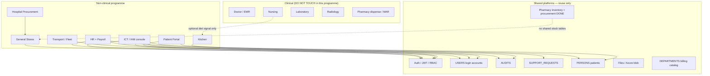
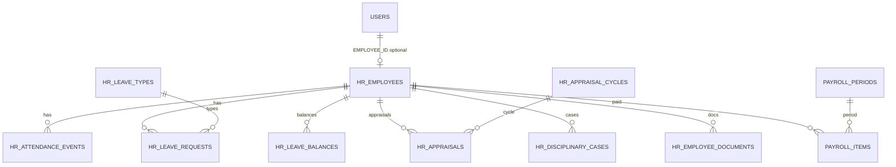
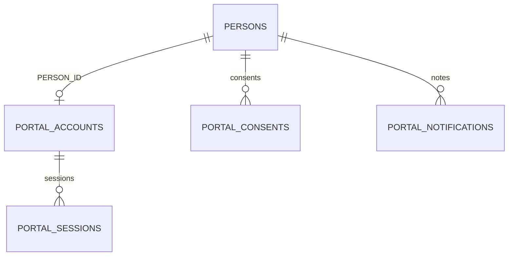
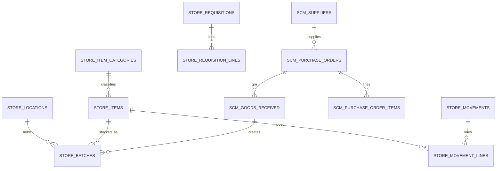
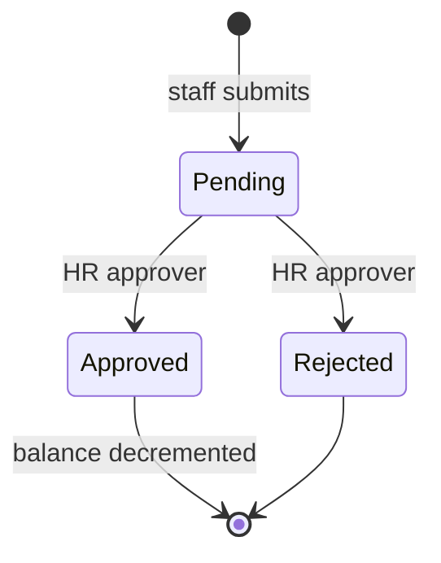
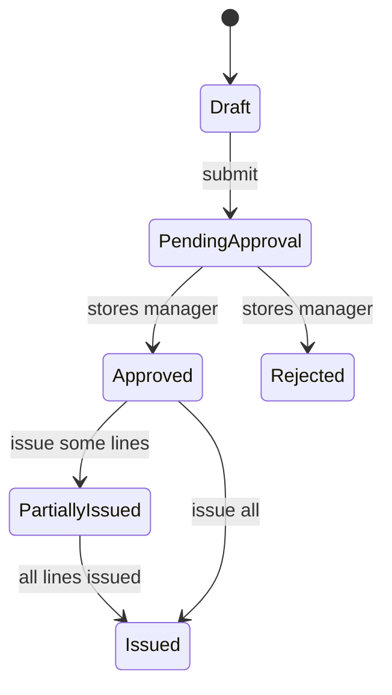

# Non-Clinical Modules — Audit Findings & Safe Implementation Plan

**Date:** 16 Sep 2026  
**Branch context:** `Abdul-Azeez` (after merge from `main`)  
**Repos:**
- Backend: `HMS-BACKEND` (NestJS + Prisma + PostgreSQL)
- Frontend: `fnph-aro` (Vite + React + TanStack Query + shadcn)

**Purpose:** Record what exists end-to-end today for the non-clinical modules listed below, what is missing or only mocked, and a phased build plan any AI/engineer can follow **without breaking existing UI, APIs, modules, or database data**.

**Document structure:**
- **Part I (§0–§20):** Audit findings, phase order, acceptance criteria.
- **Part II (§21–§33):** Design & structural contract — bounded contexts, folder layout, UX rules, nav IA, screen→KPI wiring, ERDs, API DTOs, state machines, permissions overview, integration contracts, AI PR checklist.
- **Part III (§34–§42):** RBAC, CRUD, and access-control contract — permission catalog, role maps, endpoint×CRUD matrices, FE gates, row-level rules, soft-delete policy, denial/audit behaviour.
- **Part IV (§43–§56):** Other considerations — privacy, performance, ops, data quality, integrations, UX edge cases, reporting, rollout, and open decisions.

**Progress (source of truth):** mark items in **§4.1 Fixes tracker** and **§4.2 Phases tracker** only. Rule: **do not start Phase N until Phase N−1 is 100% checked** (see §4.0).

| Lane | Current | Next unlocked when current is ✅ |
|------|---------|----------------------------------|
| Fixes FX-1…FX-6 | ✅ Done | — |
| Phases | **All A–K complete** | Plan execution finished for non-clinical scope |

**Scope list (source of truth for this plan):**
1. Patient Dashboard  
2. Human Resources / HR (+ Payroll)  
3. ICT / Information Technology  
4. Stores / Inventory (general hospital)  
5. Procurement & Stores / Supply Chain Management  
6. Kitchen / Catering Services  
7. Transport / Ambulance Administration (fleet layer)

---

## 0. Hard safety rules (read first — apply to every phase)

These rules are mandatory for every implementer (human or AI):

1. **Do not rename, drop, or rewrite existing tables** (`USERS`, `ROLES`, `PERSONS`, `DRUGS`, `PURCHASE_*`, `SUPPORT_REQUESTS`, `AUDITS`, pharmacy inventory, clinical nursing, etc.).
2. **Do not remove existing frontend routes** under `/dashboard/*`, `/pharmacy/*`, `/records/*`, `/hms/*`. Only **replace mock data sources with API hooks** inside existing pages, or add **new sibling routes**.
3. **Do not repurpose pharmacy inventory tables** for general stores. Pharmacy stays pharmacy. General stores get **new** tables under a new Prisma model file.
4. **Do not put HR employee lifecycle into `USERS` alone.** Keep `USERS` = login accounts. Link optionally via `USERS.EMPLOYEE_ID` → new `HR_EMPLOYEES.EMPLOYEE_ID`.
5. **Add new Prisma migrations only** (`prisma migrate` / new folder under `apps/api/prisma/migrations`). Never edit applied migrations.
6. **Permissions (additive only):** add new codes to `permissions.constants.ts` and map them on roles; do not strip existing `ROLE_PERMISSIONS` entries. Every new mutating endpoint must use `@RequirePermissions(...)` after `JwtAuthGuard`.
7. **Feature-flag or role-gate** new modules on the FE (nav + route); API remains the source of truth for authorization. Leave clinical modules untouched.
7a. **CRUD completeness:** for each new resource expose Create / Read / Update / Delete (or soft-deactivate) with distinct permissions where risk differs (`*:create`, `*:read`, `*:update`, `*:delete` / `*:approve`). Never ship write without read, or delete without an audit trail.
7b. **No silent elevation:** do not grant `FULL_ACCESS` to new operational roles (`HR`, `NUTRITION`, stores clerks). Prefer explicit permission lists like `RECORDS_PERMISSIONS`.
8. **Wire one vertical slice at a time** (schema → API → replace mock in existing page). Do not rebuild the whole HR UI from scratch. **Follow §4.0:** finish and checkmark the current phase before starting the next.
9. **Preserve mock fallback** behind `VITE_USE_API` / try-API-then-fallback only if already used; preferred pattern: use live API when authenticated, show empty states (not dummy rows) when API returns empty.
10. **Update `docs/FEATURES.md` and `docs/CHANGELOG.md`** when a phase ships; correct any false “✅” that claim empty Nest shells are live. **Also update §4.1 / §4.2 checkboxes** in this file.

---

## 1. Executive status summary

| # | Module | Frontend | Backend | DB / migrations | End-to-end? | Verdict |
|---|--------|----------|---------|-----------------|-------------|---------|
| 1 | Patient Dashboard | Rich routes under `/dashboard/patient/*` — **mock data** | No patient self-service APIs | `PERSONS` exists; no portal schema | **No** | **PARTIAL** — UI shell only |
| 2 | HR | `/dashboard/hr/*` — live API when `VITE_USE_API` (Overview/Staff/Attendance/Leave/Performance/Payroll) | `/api/hr/*` Phases A–E live | `HR_*` tables + migration `20260916120000_hr_modules_phases_a_e` | **Yes (A–E)** after migrate deploy | **DONE A–E** |
| 2b | Payroll | `/dashboard/hr/payroll` wired | `/api/hr/payroll/*` | `HR_PAYROLL_*` | **Yes** | **DONE** |
| 3 | ICT | `/dashboard/it/*` + SuperAdmin/IAM — mostly mock | **Live:** auth, users, audit, support; **stubs:** roles/permissions/system-settings empty | `USERS`, `ROLES`, `REFRESH_TOKENS`, `AUDITS`, `SUPPORT_REQUESTS` | **Partial E2E** for core IAM building blocks | **PARTIAL** |
| 4 | Stores (general) | **No** general stores UI | Empty `InventoryModule` (no endpoints) | None for general stores | **No** | **NOT STARTED** (pharmacy inventory is separate and DONE) |
| 5 | Procurement / SCM | Pharmacy procurement UI **live** | Pharmacy procurement **live**; general inventory/procurement empty | Pharmacy `SUPPLIERS`, `PURCHASE_*`, `DRUG_*` | Pharmacy **DONE**; hospital SCM **NOT STARTED** | **PARTIAL** |
| 6 | Kitchen / Catering | Mock under Nutrition `/dashboard/nutrition/catering` | None | None | **No** | **PARTIAL** — mock UI only |
| 7 | Transport / Fleet | **No** module routes | None | None | **No** | **NOT STARTED** |

**Doc note:** Inventory general remains scaffold; HR Phases A–E are live in code (run `prisma migrate deploy` on Azure before relying on APIs).

---

## 2. Detailed findings vs requested feature list

### 2.1 Patient Dashboard

**Requested:** Patient-facing dashboard (booking, invoices, history, records, lab, prescriptions, notifications, profile).

| Capability | Status | Evidence |
|------------|--------|----------|
| Route shell + nav | Done (UI) | `fnph-aro/src/App.tsx` routes `/dashboard/patient…`; `PatientDashboard.tsx` |
| Live data from API | Missing | Uses `dummyData` / local mock OTP |
| Patient self-auth / portal session | Missing | Staff JWT auth only; public booking OTP is for appointments, not full portal |
| Backend portal module | Missing | No `patient-portal` Nest module |
| DB portal tables | Missing | Patients are `PERSONS`; no portal preferences/notifications store |

**Related live (staff, not patient portal):** Records dashboard + patient directory (`/api/records/*`) — do not confuse with Patient Dashboard.

---

### 2.2 Human Resources / HR

**Requested dashboards & modules:** Total/active staff, leave, absent, new/retiring, by department/cadre, employment type, attendance, punctuality, overtime, leave status, training, appraisal, promotions, disciplinary, documents; Employee Management; Attendance; Leave; Performance.

| Capability | Status | Evidence |
|------------|--------|----------|
| FE routes (overview, staff, attendance, leave, performance, payroll, training, …) | UI present | `App.tsx` `/dashboard/hr/*`; `HrDashboard.tsx` |
| FE live API | Almost none | Imports `hrData` / `dummyData`; only **Support** uses `listSupportRequests` |
| Nest `HrModule` | Scaffold only | `apps/api/src/hr/*` — empty service; controllers with no handlers |
| Employee master DB | Missing | `USERS.EMPLOYEE_ID` column exists but no `HR_EMPLOYEES` table |
| Attendance / leave / appraisal tables | Missing | — |

---

### 2.3 Payroll Department

| Capability | Status | Evidence |
|------------|--------|----------|
| Dashboard UI under HR | Mock | `HrPayroll` in `HrDashboard.tsx` |
| Gross/net/deductions/PAYE/pension/loans | Missing | Mock columns only |
| Backend + DB | Missing | — |

**Note:** Cashier/billing is **patient revenue**, not staff payroll. Do not reuse cashier tables for payroll.

---

### 2.4 ICT / Information Technology

| Capability | Status | Evidence |
|------------|--------|----------|
| User login / refresh / change password | **DONE E2E** | `auth` module |
| List/search users, profile | **DONE E2E** | `users` module; FE `lib/api/users.ts` |
| Role–permission map | **DONE (code)** | `permissions.constants.ts` + guard — **not** DB-editable UI |
| Audit logs API | **DONE E2E** | `audit` module; FE `lib/api/audit.ts` |
| Support tickets | **DONE E2E** | `support-requests`; HR Support page live |
| IT dashboard (system status, servers, backup, security alerts) | Mock | `ItDashboard.tsx` |
| SuperAdmin / IAM screens | Mock | `SuperAdminDashboard.tsx`, `IamSecurityCenter.tsx` |
| Role CRUD / permission CRUD UI+API | Missing / empty stubs | `roles`, `permissions` Nest shells empty |
| Backup automation, network probes | Missing | — |

---

### 2.5 Stores / Inventory (general)

| Capability | Status | Evidence |
|------------|--------|----------|
| General stores dashboard | Missing | No `/stores` routes |
| Nest inventory module | Empty scaffold | `inventory.service.ts` empty; no endpoints |
| Pharmacy inventory | **DONE E2E** | `/pharmacy/inventory` ↔ `/api/pharmacy/inventory` ↔ `DRUGS` / `DRUG_BATCHES` |

**Rule:** Pharmacy inventory remains specialised. General stores is a **new** domain.

---

### 2.6 Procurement & Supply Chain

| Capability | Status | Evidence |
|------------|--------|----------|
| Pharmacy PR / PO / GRN / suppliers | **DONE E2E** | `PharmacyProcurement.tsx`, `procurement.controller.ts`, pharmacy Prisma models |
| Central Store / Medical Consumables / General Store | Missing | — |
| Cross-department requisitions (non-drug) | Missing | — |
| Supplier performance (hospital-wide) | Missing | Pharmacy suppliers only |

**Recommended product shape:** parent **Supply Chain** with sub-units: Procurement, Central Store, Pharmacy Store (existing), Medical Consumables, General Store, Supplier Management. Pharmacy Store keeps using existing pharmacy APIs.

---

### 2.7 Kitchen / Catering

| Capability | Status | Evidence |
|------------|--------|----------|
| Catering page under Nutrition | Mock UI | `/dashboard/nutrition/catering` |
| Meal production / delivery / wastage DB | Missing | — |
| Link from nursing diet orders | Not wired | Clinical notes may mention diet; no kitchen queue |

---

### 2.8 Transport / Ambulance (fleet)

| Capability | Status | Evidence |
|------------|--------|----------|
| Fleet / trip / fuel / maintenance module | Missing | Marketing/ambulance icons only |
| Clinical ambulance dispatch | Missing as ops module | Future-modules doc mentions Transportation |

*(List item 8 in the request duplicates item 7 — treated as one module.)*

---

## 3. What to reuse (patterns that already work)

Copy these patterns; do not invent a second architecture:

| Pattern | Where to copy from |
|---------|-------------------|
| Domain Nest module (controller + service + DTO + permissions) | `pharmacy/`, `nursing/`, `support-requests/` |
| Prisma model file + `@@map` snake/UPPER tables | `apps/api/prisma/models/pharmacy.prisma` |
| New migration folder | `apps/api/prisma/migrations/YYYYMMDDHHMMSS_*/migration.sql` |
| FE API client | `fnph-aro/src/lib/api/pharmacy.ts`, `support.ts` |
| FE page replacing mock with TanStack Query | `PharmacyProcurement.tsx`, HR Support section in `HrDashboard.tsx` |
| Dashboard layout + role nav | Existing `DashboardLayout` + role-specific nav arrays in `App.tsx` / layout configs |
| Permissions constants | `apps/api/src/common/constants/permissions.constants.ts` |

---

## 4. Proposed implementation order (priority)

Aligned with Patient Dashboard and HR first, then ICT, then supply chain, kitchen, transport.

| Phase | Name | Goal | Risk to existing systems |
|-------|------|------|---------------------------|
| **A** | Foundations & doc honesty | Fix FEATURES.md; add permission codes; FE permissions in AuthContext | Very low |
| **B** | HR Employee master + dashboard KPIs | First real HR E2E slice | Low — new tables only |
| **C** | HR Attendance + Leave | Ops workflows on existing HR pages | Low |
| **D** | HR Performance (+ light disciplinary/docs) | Appraisal cycles | Low |
| **E** | Payroll (own dashboard under HR/Finance) | Payslip + statutory fields | Medium — isolate from cashier |
| **F** | Patient Dashboard live read APIs | Wire existing patient UI to real data | Medium — auth model careful |
| **G** | ICT console hardening | Live IT dashboard from real metrics; role UI optional | Low–medium |
| **H** | Supply Chain — general stores + requisitions | New inventory domain; leave pharmacy alone | Medium |
| **I** | Supply Chain — hospital procurement | Non-drug PR/PO/GRN | Medium |
| **J** | Kitchen / Catering | New module; optional nursing diet feed | Low |
| **K** | Transport / Fleet | New module | Low |

### 4.0 Sequential gate (mandatory)

```text
FX fixes ──► A ──► B ──► C ──► D ──► E ──► F ──► G ──► H ──► I ──► J ──► K
              ▲
              └── each box must be fully ✅ before the next box starts
```

| Rule | Detail |
|------|--------|
| **One active phase** | Only one phase may be “In progress”. Next phase stays 🔒 Locked. |
| **No skipping** | Do not start C while B is partial; do not start H while F/G incomplete. |
| **No parallel modules** | Patient Dashboard (F) waits until E is ✅. Stores (H) waits until G is ✅. |
| **Sub-steps** | Inside a phase, finish DB → API → FE → tests → docs in order before marking the phase ✅. |
| **Definition of Done** | All checkboxes under that phase in §4.2 are `[x]`, plus §16 regression + Part III §42 + Part IV §56. |
| **How to mark** | Change `- [ ]` to `- [x]` and set the phase row Status to ✅ Done. Update the Progress strip at the top of this file. |
| **Blocked work** | If blocked, leave Status as 🔄 In progress and note the blocker under the phase — do not open the next phase. |

**Status legend:** ⬜ Not started · 🔒 Locked · 🔄 In progress · ✅ Done · ⏸ Blocked

---

### 4.1 Fixes tracker (complete before / during Phase A)

Audit gaps that must be corrected so later phases are honest and safe. Mark each when merged.

| ID | Fix | Where | Status | Done |
|----|-----|-------|--------|------|
| FX-1 | Correct `FEATURES.md`: HR + general Inventory are scaffold/⏳, not live ✅ | `docs/FEATURES.md` | ✅ | - [x] |
| FX-2 | Point docs index / CHANGELOG at this plan | `docs/CHANGELOG.md` | ✅ | - [x] |
| FX-3 | Add HR permission codes to `PERMISSIONS` + `HR_CORE_PERMISSIONS` bundle | `permissions.constants.ts` | ✅ | - [x] |
| FX-4 | Map `ROLES.HR` to HR bundle (keep `support:*`; do not use `FULL_ACCESS`) | `ROLE_PERMISSIONS` | ✅ | - [x] |
| FX-5 | Load `permissions[]` from `GET /api/auth/me` into FE `AuthContext` + `can()` helper | `fnph-aro` AuthContext / `lib/rbac.ts` | ✅ | - [x] |
| FX-6 | Gate `/dashboard/hr/*` routes + filter `hrNav` by permission/role | `App.tsx` / `HrDashboard.tsx` | ✅ | - [x] |

**Fixes exit criteria:** FX-1, FX-3, FX-4, FX-5, FX-6 all `[x]` before Phase A is marked ✅. (FX-2 may stay ongoing for changelog hygiene.)

---

### 4.2 Phases tracker (checkmark = complete; locked until prior ✅)

#### Master table

| # | Phase | Deliverable (summary) | Depends on | Status | Phase done |
|---|-------|----------------------|------------|--------|------------|
| 0 | **Fixes FX-1…FX-6** | Doc honesty + RBAC foundation | — | ✅ | - [x] |
| 1 | **A** Foundations | Perms + FEATURES + FE `can()` | Fixes (excl. ongoing FX-2) | ✅ | - [x] |
| 2 | **B** HR employees + dashboard | `HR_EMPLOYEES` + CRUD + wire Overview/Staff | A ✅ | ✅ | - [x] |
| 3 | **C** Attendance + Leave | Tables + APIs + Attendance/Leave pages | B ✅ | ✅ | - [x] |
| 4 | **D** Performance + docs | Appraisals / disciplinary / documents | C ✅ | ✅ | - [x] |
| 5 | **E** Payroll | Runs, statutory fields, payroll page | D ✅ | ✅ | - [x] |
| 6 | **F** Patient Dashboard | Portal read APIs + replace patient mocks | E ✅ | ✅ | - [x] |
| 7 | **G** ICT console | Live metrics on IT dashboard | F ✅ | ✅ | - [x] |
| 8 | **H** General stores | New stores domain ≠ pharmacy | G ✅ | ✅ | - [x] |
| 9 | **I** Hospital SCM | Non-drug PR/PO/GRN + SCM dashboard | H ✅ | ✅ | - [x] |
| 10 | **J** Kitchen | Catering live data | I ✅ | ✅ | - [x] |
| 11 | **K** Transport / Fleet | Vehicles, trips, fuel, maintenance | J ✅ | ✅ | - [x] |

---

#### Phase A — Foundations · Status: ✅ Done (2026-09-16)

- [x] FX-1 FEATURES.md corrected  
- [x] FX-3 HR `PERMISSIONS` constants added (§34.1 minimum: dashboard + employee + leave stubs as needed for A)  
- [x] FX-4 `ROLE_PERMISSIONS[HR]` expanded additively  
- [x] FX-5 FE stores `permissions` + `can()`  
- [x] FX-6 HR route/nav gated  
- [x] `GET /api/auth/me` returns new HR perms for HR user  
- [x] Doctor login unchanged; clinical smoke OK  
- [x] `npm run build` + `typecheck` both repos  
- [x] CHANGELOG entry for Phase A  
- [x] **Phase A complete** → set master row ✅ and unlock B  

---

#### Phase B — HR Employee + Dashboard · Status: ✅ Done (2026-09-16)

- [x] Prisma `HR_EMPLOYEES` (+ indexes) migration applied (no unrelated drops)  
- [x] `GET /api/hr/dashboard` + employee C/R/U/deactivate with guards + audit  
- [x] DTOs validated; soft-delete only  
- [x] `HrOverview` KPIs from API (empty state if none)  
- [x] `HrStaff` list/create/edit from API (no `hrData` fake names in API mode)  
- [x] AuthZ: doctor 403 on HR APIs (§41)  
- [x] §16 regression checklist  
- [x] FEATURES.md + CHANGELOG  
- [x] **Phase B complete** → unlock C  

---

#### Phase C — Attendance + Leave · Status: ✅ Done (2026-09-16)

- [x] Attendance + leave tables migrated  
- [x] Attendance C/R/U APIs + Leave C/R/U/approve APIs + perms  
- [x] Ownership: self-leave vs HR approve; no self-approve  
- [x] `HrAttendance` + `HrLeave` wired; Overview cards for on-leave/absent updated  
- [x] §16 + §41 leave tests  
- [x] FEATURES.md + CHANGELOG  
- [x] **Phase C complete** → unlock D  

---

#### Phase D — Performance / Disciplinary / Documents · Status: ✅ Done (2026-09-16)

- [x] Appraisal / disciplinary / document tables  
- [x] APIs + `hr:appraisal:*` / `hr:disciplinary:*` / `hr:document:*`  
- [x] `HrPerformance` (+ compliance/docs UI) live; no PHI leakage  
- [x] §16 regression  
- [x] FEATURES.md + CHANGELOG  
- [x] **Phase D complete** → unlock E  

---

#### Phase E — Payroll · Status: ✅ Done (2026-09-16)

- [x] Payroll period/run/line tables; locked runs immutable  
- [x] APIs: read / run / update unlocked / lock — idempotent run  
- [x] `HrPayroll` live; **not** using cashier tables  
- [x] D1 decision recorded (HR vs Finance `payroll:run`)  
- [x] No BVN/NIN unless D10 decided  
- [x] §16 + payroll authZ tests  
- [x] FEATURES.md + CHANGELOG  
- [x] **Phase E complete** → unlock F  

---

#### Phase F — Patient Dashboard · Status: ✅ Done (2026-09-16)

- [x] Auth approach chosen (D5) and documented in DECISIONS.md  
- [x] `patient-portal` module: dashboard/invoices/labs/Rx/records/appointments reads  
- [x] Row-level `PERSON_ID` checks on every portal route  
- [x] Patient UI mocks replaced with API; OTP/demo gated  
- [x] Staff clinical APIs unchanged  
- [x] §16 + portal authZ (§41.7)  
- [x] FEATURES.md + CHANGELOG  
- [x] **Phase F complete** → unlock G  

---

#### Phase G — ICT console · Status: ✅ Done (2026-09-16)

- [x] IT dashboard cards use real user/audit/support (or honest “Not instrumented”)  
- [x] No fake green server/backup status  
- [x] Role/permission DB UI still deferred unless D12 approved  
- [x] Auth/JWT/RBAC clinical unchanged  
- [x] §16 regression  
- [x] FEATURES.md + CHANGELOG  
- [x] **Phase G complete** → unlock H  

---

#### Phase H — General Stores · Status: ✅ Done (2026-09-16)

- [x] New stores Prisma models (not pharmacy tables)  
- [x] Items + stock issue/receive/adjust + requisitions APIs + `stores:*` perms  
- [x] FE routes added; pharmacy inventory untouched  
- [x] Transactions + audit on stock movements  
- [x] §16 + pharmacist cannot write stores (§41.5)  
- [x] FEATURES.md + CHANGELOG  
- [x] **Phase H complete** → unlock I  

---

#### Phase I — Hospital SCM · Status: ✅ Done (2026-09-16)

- [x] Hospital PR/PO/GRN (+ suppliers if D4 = separate)  
- [x] `scm:*` perms; pharmacy procurement unchanged  
- [x] GRN → store batches in one transaction  
- [x] SCM executive dashboard wired  
- [x] §16 regression  
- [x] FEATURES.md + CHANGELOG  
- [x] **Phase I complete** → unlock J  

---

#### Phase J — Kitchen · Status: ✅ Done (2026-09-16)

- [x] Kitchen/menu/order/wastage tables  
- [x] APIs + `kitchen:*`; nutrition catering page live  
- [x] No writes to clinical notes from kitchen  
- [x] D6 nurse-order decision respected  
- [x] §16 regression  
- [x] FEATURES.md + CHANGELOG  
- [x] **Phase J complete** → unlock K  

---

#### Phase K — Transport / Fleet · Status: ✅ Done (2026-09-16)

- [x] Vehicles / drivers / trips / fuel / maintenance tables  
- [x] APIs + `fleet:*`; `/dashboard/transport/*` UI  
- [x] Optional clinical trip-create only (D7)  
- [x] §16 regression  
- [x] FEATURES.md + CHANGELOG  
- [x] **Phase K complete** → all non-clinical plan phases ✅  

---

### 4.3 AI / engineer working protocol

1. Read §4.0–§4.2 and the Progress strip at the top.  
2. Identify the single 🔄 / first 🔒 unlocked phase.  
3. Implement **only** that phase’s unchecked boxes.  
4. Run §16 + §42 + §56.  
5. Mark checkboxes `[x]`, set Status ✅, unlock the next phase (🔒 → ⬜/🔄).  
6. Stop. Do not begin the next phase in the same PR unless the user explicitly orders a combined close of A→B after A is already ✅.

**Forbidden:** “While I’m here” stores work during HR phases; scaffolding Phase H tables during Phase B; marking a phase ✅ with failing typecheck.

---

## 5. Phase A — Foundations (no user-facing breakage)

### A.1 Documentation
- Correct `docs/FEATURES.md`: mark HR / Inventory general as ⏳ or “scaffold only”.
- Add this file to related docs index if one exists.
- `CHANGELOG.md`: note audit + plan added.

### A.2 Permissions (additive only) — see Part III for full catalog

**Today’s gap (must fix in Phase A before HR CRUD):**
- `ROLES.HR` currently maps only to `support:create|read|update` — **no HR domain permissions exist** in `PERMISSIONS`.
- `ROLES.IT` / `ADMIN` / `SUPER_ADMIN` / `CMD` already have `FULL_ACCESS` (inherits every new perm automatically — still register codes for explicit guards).
- Frontend AuthContext stores `role` / `roles` but **does not yet gate UI by `permissions`** from `GET /api/auth/me` (which already returns `permissions[]`).

**Phase A minimum additions** (exact keys in §34):
- HR: `hr:employee:*`, `hr:dashboard:read`, `hr:leave:*`, …
- Later phases add stores/scm/kitchen/fleet/portal codes in the same PR as their first endpoint.

Map onto roles carefully:
- `HR` → HR permission bundle (not `FULL_ACCESS`).
- `FINANCE` → payroll read (+ run only if product agrees); never clinical write.
- Do **not** remove clinical permissions from doctors/nurses.
- Do **not** reuse pharmacy `procurement:*` / `stock:*` for general stores.

### A.3 Acceptance
- Existing login + clinical flows unchanged.
- `GET /api/auth/me` returns new permission strings for HR role after map update.
- `npm run build` + `npm run typecheck` pass on both repos.

---

## 6. Phase B — HR Employee Management + HR Dashboard (first E2E)

### B.1 Database

**New file:** `apps/api/prisma/models/hr.prisma` (example shapes — adjust names but keep `@@map` UPPER_SNAKE):

```prisma
model HrEmployees {
  EMPLOYEE_ID      Int       @id @default(autoincrement())
  EMPLOYEE_NO      String    @unique @db.VarChar(40)  // staff ID badge
  USER_ID          Int?      @unique                 // optional link to USERS
  FIRST_NAME       String    @db.VarChar(100)
  LAST_NAME        String    @db.VarChar(100)
  DEPARTMENT_ID    Int?
  DEPARTMENT_NAME  String?   @db.VarChar(150)        // denorm OK if needed
  DESIGNATION      String?   @db.VarChar(150)
  GRADE_LEVEL      String?   @db.VarChar(50)
  CADRE            String?   @db.VarChar(100)
  /// Permanent | Contract | Locum
  EMPLOYMENT_TYPE  String    @default("Permanent") @db.VarChar(30)
  /// Active | OnLeave | Suspended | Exited | Retired
  STATUS           String    @default("Active") @db.VarChar(30)
  DATE_JOINED      DateTime?
  DATE_OF_BIRTH    DateTime?
  EXPECTED_RETIRE_DATE DateTime?
  QUALIFICATIONS   String?   @db.Text
  CERTIFICATIONS   String?   @db.Text
  NEXT_OF_KIN      String?   @db.VarChar(255)
  NEXT_OF_KIN_PHONE String?  @db.VarChar(50)
  EMERGENCY_CONTACT String?  @db.VarChar(255)
  EMERGENCY_PHONE  String?   @db.VarChar(50)
  EMPLOYMENT_HISTORY String? @db.Text
  CREATED_DATE     DateTime  @default(now())
  UPDATED_DATE     DateTime?

  @@index([STATUS])
  @@index([DEPARTMENT_ID])
  @@index([EMPLOYMENT_TYPE])
  @@map("HR_EMPLOYEES")
}
```

**Migration steps:**
1. Create Prisma models.
2. `npx prisma migrate dev --name hr_employees` (or deploy-safe SQL migration in CI style used by this repo).
3. Optionally backfill: for each `USERS` row with name/email, create stub `HR_EMPLOYEES` and set `USERS.EMPLOYEE_ID` — **only in a dedicated seed/script**, never silently in production API.

**Do not:** alter `DEPARTMENTS` semantics used by billing.

### B.2 Backend

Fill existing `HrModule` (do not create a second HR module):

| Method | Route | Permission | CRUD |
|--------|-------|------------|------|
| Dashboard KPIs | `GET /api/hr/dashboard` | `hr:dashboard:read` | R |
| List employees | `GET /api/hr/employees` | `hr:employee:read` | R |
| Get employee | `GET /api/hr/employees/:id` | `hr:employee:read` | R |
| Create | `POST /api/hr/employees` | `hr:employee:create` | C |
| Update | `PATCH /api/hr/employees/:id` | `hr:employee:update` | U |
| Soft-deactivate | `POST /api/hr/employees/:id/deactivate` | `hr:employee:delete` | D |
| Reactivate | `POST /api/hr/employees/:id/reactivate` | `hr:employee:update` | U |

Controller pattern (mandatory):

```typescript
@UseGuards(JwtAuthGuard, PermissionsGuard)
@RequirePermissions(PERMISSIONS.HR_EMPLOYEE_READ)
@Get('employees')
listEmployees(...) { ... }
```

Every create/update/deactivate must call `AuditService` with actor `USER_ID`, resource id, and before/after summary. Full matrices: **§36**.

**KPI payload** (match FE cards gradually):
- `totalStaff`, `activeStaff`, `onLeave`, `absentToday` (0 until attendance phase), `newEmployees` (joined this month), `retiringSoon` (within 12 months), `byDepartment[]`, `byCadre[]`, `byEmploymentType` { permanent, contract, locum }.

Use Nest DTOs + `class-validator`. Audit writes via existing `AuditService`.

### B.3 Frontend

**File to edit:** `fnph-aro/src/pages/HrDashboard.tsx` (+ new `src/lib/api/hr.ts`).

1. Add `listHrEmployees`, `getHrDashboard` API helpers (same client pattern as `support.ts`).
2. In `HrOverview`: replace `hrData` summary numbers with `useQuery(['hr','dashboard'], …)`.
3. In `HrStaff`: replace `staffMembers` mock table with API list; keep **existing table layout, columns, buttons** — only change data source.
4. Empty state: “No employees yet” — never fall back to fake names in production builds.
5. Do **not** change `hrNav` paths.

### B.4 Acceptance
- HR Overview cards show DB counts.
- HR Staff lists real employees.
- Clinical dashboards unchanged.
- Support page still works.

---

## 7. Phase C — Attendance + Leave

### C.1 Database (additive)

```text
HR_ATTENDANCE_EVENTS  — EMPLOYEE_ID, EVENT_TYPE (In|Out), AT, SOURCE, LATE_FLAG, EARLY_DEPARTURE_FLAG
HR_SHIFTS             — optional shift definitions
HR_LEAVE_TYPES        — Annual, Sick, Maternity, Paternity, Study, Other
HR_LEAVE_BALANCES     — EMPLOYEE_ID, LEAVE_TYPE_ID, YEAR, ENTITLEMENT, USED
HR_LEAVE_REQUESTS     — EMPLOYEE_ID, TYPE, FROM, TO, STATUS (Pending|Approved|Rejected), APPROVED_BY, REASON
```

### C.2 Backend
- `POST /api/hr/attendance/clock` (self or kiosk)
- `GET /api/hr/attendance` (register filters)
- `GET/POST /api/hr/leave/requests`
- `PATCH /api/hr/leave/requests/:id/approve|reject` (`hr:leave:approve`)

Dashboard fields unlocked: absent today, punctuality %, overtime (compute from clock pairs vs shift — start simple).

### C.3 Frontend
- Wire `/dashboard/hr/attendance` and `/dashboard/hr/leave` in `HrDashboard.tsx`.
- Keep existing approve/reject UX; call API instead of local state only.

### C.4 Acceptance
- Leave approve updates DB and refreshes list.
- No change to nursing/doctor modules.

---

## 8. Phase D — Performance (Appraisal / KPI / Promotion)

### D.1 Database
```text
HR_APPRAISAL_CYCLES
HR_APPRAISALS — employee, cycle, scores JSON, reviewer, status
HR_PROMOTION_RECOMMENDATIONS
HR_DISCIPLINARY_CASES (optional same phase or D2)
HR_EMPLOYEE_DOCUMENTS — file metadata pointing at existing files/storage service
```

### D.2 Backend + FE
- CRUD under `/api/hr/appraisals`, `/api/hr/promotions`.
- Wire `/dashboard/hr/performance` (and compliance/training pages incrementally).

### D.3 Safety
- Store documents via existing `files/storage.service.ts`; do not invent a second blob stack if Azure storage already configured.

---

## 9. Phase E — Payroll (own dashboard, under HR)

### E.1 Product placement
- Keep route `/dashboard/hr/payroll` **or** add `/dashboard/payroll` with same layout — prefer **keeping existing route** to avoid nav churn.
- Later: Finance role can receive `hr:payroll:read` without full HR write.

### E.2 Database
```text
PAYROLL_PERIODS — month/year, status (Open|Closed)
PAYROLL_ITEMS — employee, basic, allowances, overtime, deductions, PAYE, pension, loans, advances, net, department, grade
PAYROLL_LOANS / PAYROLL_ADVANCES (optional split)
```

### E.3 Backend
- `GET /api/hr/payroll/dashboard`
- `POST /api/hr/payroll/periods/:id/run` (idempotent per employee)
- Never touch `CASHIER_*` or billing tables.

### E.4 Frontend
- Replace mock payroll table; add department/grade aggregates matching the requested dashboard list.

### E.5 Nigeria statutory note
- Implement PAYE/pension as **configurable rates** in settings table, not hard-coded magic numbers scattered in UI.

---

## 10. Phase F — Patient Dashboard (live reads)

### F.1 Auth decision (choose one — document in DECISIONS.md)
**Recommended MVP:** Patient portal uses **existing public booking verification + hospital number**, then issues a **short-lived portal JWT** with claim `portal:patient` and `personId` — separate from staff `USERS` JWT.  
**Alternative:** Link `USERS` with a `Patient` role (heavier; more RBAC risk).

### F.2 Backend (new module `patient-portal` — do not overload `patients` staff APIs)
Read-only aggregations for the authenticated `personId`:
- `GET /api/portal/me`
- `GET /api/portal/appointments` (from `FOLLOW_UPS` / `SERVICE_BOOKINGS` where person matches)
- `GET /api/portal/invoices` (cashier bills for person — **read only**)
- `GET /api/portal/lab-results` (released results only)
- `GET /api/portal/prescriptions`
- `GET /api/portal/notifications` (optional table later)

**Enforce:** every query filters `PERSON_ID = token.personId`. Never accept client-supplied personId without matching token.

### F.3 Frontend
- Edit `PatientDashboard.tsx` sections only: swap mocks for portal API.
- Keep route paths identical.
- Remove hardcoded demo OTP once real verify flow exists; until then gate with feature flag.

### F.4 Acceptance
- Staff Records/Patient Entry unchanged.
- Patient cannot see another person’s data (add a simple e2e or unit test on service).

---

## 11. Phase G — ICT console (build on live foundations)

### G.1 Already done — do not rebuild
Auth, users list/me, audit logs, support tickets, permission guard.

### G.2 Wire IT dashboard to real metrics
In `ItDashboard.tsx`:
- Users online → optional presence (chat presence already exists) or “active refresh tokens last 15m”
- Failed logins → count from `AUDITS` where type matches login failure (add audit events if missing)
- Support tickets open → `support-requests` counts
- System errors → audit/error logs subset

### G.3 Optional later: DB-backed roles UI
Only if product requires editable permissions:
- New tables `PERMISSION_CATALOG`, `ROLE_PERMISSIONS` — **dual-read** with code map until cutover.
- SuperAdmin screens currently mock — replace gradually.

### G.4 Do not break
Password rules, JWT refresh, existing clinical RBAC.

---

## 12. Phase H — General Stores / Inventory

### H.1 Separation from pharmacy
| Concern | System |
|---------|--------|
| Drugs / batches / FEFO pharmacy | Existing pharmacy module (**unchanged**) |
| Consumables, stationery, PPE, equipment, cleaning, maintenance materials | **New** `stores` module |

### H.2 Database (new `stores.prisma`)
```text
STORE_LOCATIONS — Central, Ward store, CSSD, …
STORE_ITEM_CATEGORIES — MedicalConsumables, Office, Cleaning, Stationery, Equipment, Maintenance, PPE, Other
STORE_ITEMS — sku, name, category, unit, reorder_level
STORE_BATCHES — item, batch/serial, expiry, qty, location
STORE_MOVEMENTS — in/out/transfer/adjust/return, ref, actor
STORE_REQUISITIONS — from dept, lines, status Pending|Approved|Issued|Rejected
```

### H.3 Backend
New Nest module `stores` (prefer **not** filling empty `inventory` with mixed pharmacy semantics — either rename empty inventory to stores carefully or implement `stores` and leave `inventory` stub deprecated in FEATURES.md).

APIs: dashboard KPIs (total SKUs, low stock, out of stock, expiring, stock value, pending requisitions), stock-in/out, transfer, count.

### H.4 Frontend
- **Add** new routes e.g. `/dashboard/stores`, `/dashboard/stores/items`, `/dashboard/stores/requisitions`.
- New nav entry for stores/inventory role — **do not** remove `/pharmacy/inventory`.

### H.5 Acceptance
- Pharmacy procurement + inventory regression test / manual smoke still pass.

---

## 13. Phase I — Hospital Procurement & SCM umbrella

### I.1 Architecture
```text
Supply Chain (nav group)
  ├── Procurement (hospital / non-drug)     NEW
  ├── Central Store                        Phase H
  ├── Pharmacy Store                       EXISTING pharmacy routes
  ├── Medical Consumables                  category filter on stores
  ├── General Store                        location filter
  └── Supplier Management                  extend or parallel to pharmacy suppliers
```

### I.2 Options for suppliers
- **A (safer):** `SCM_SUPPLIERS` separate from `SUPPLIERS` (pharmacy).  
- **B:** add `SUPPLIER_KIND` (`Pharmacy`|`General`|`Both`) on existing `SUPPLIERS` — requires careful FE filters so pharmacy screens only show pharmacy suppliers.

Prefer **A** for zero pharmacy breakage.

### I.3 Hospital PR/PO/GRN
Mirror pharmacy procurement service shapes (`stats`, `requests`, `orders`, `receive`) under `/api/scm/procurement/*` writing to `SCM_PURCHASE_*` tables that post stock into `STORE_BATCHES` (not `DRUG_BATCHES`).

### I.4 Executive SCM dashboard
Aggregate: procurement spend, inventory value (stores + optional pharmacy value API), stock-outs, expiring, supplier scorecards, pending approvals, outstanding deliveries.

---

## 14. Phase J — Kitchen / Catering

### J.1 Database
```text
KITCHEN_MEAL_SLOTS — Breakfast|Lunch|Dinner
KITCHEN_PATIENT_MEAL_ORDERS — PERSON_ID, ADMISSION_ID?, diet flags, status
KITCHEN_MENUS / KITCHEN_PRODUCTION_LOGS
KITCHEN_WASTAGE
KITCHEN_FOOD_STOCK (or reuse stores category Food)
```

### J.2 Integration
- Optional: nursing care / clinical diet instruction creates a **meal order** row (event or API). Kitchen UI never writes clinical notes.

### J.3 Frontend
- Replace mock at `/dashboard/nutrition/catering` first (keep path).
- Add kitchen role nav if needed.

---

## 15. Phase K — Transport / Fleet

### K.1 Database
```text
FLEET_VEHICLES — reg, type, status (Available|OnTrip|Repair), insurance, registration dates
FLEET_DRIVERS
FLEET_TRIPS — vehicle, driver, purpose, from/to, mileage start/end, fuel
FLEET_MAINTENANCE
FLEET_TRIP_REQUESTS — requester, status approval
```

### K.2 Frontend
- New `/dashboard/transport/*` — no existing page to preserve; follow `DashboardLayout` patterns from HR/IT.
- Clinical ambulance request (if added later) should **create a trip request**, not duplicate fleet tables.

---

## 16. Testing & regression checklist (every phase)

Run before marking a phase done:

**Backend**
- [ ] `npm run build`
- [ ] `npm run typecheck`
- [ ] `npm run lint` (fix or note pre-existing failures)
- [ ] Targeted service unit tests for new services
- [ ] Manual smoke: login as doctor/nurse/records/pharmacy — core screens load

**Frontend**
- [ ] `npm run build`
- [ ] `npm run typecheck`
- [ ] Smoke: pharmacy inventory + procurement still load data
- [ ] Smoke: HR Support tickets still load
- [ ] Smoke: Records directory still loads

**Database**
- [ ] Migration applies on clean and on existing Azure DB
- [ ] No DROP of unrelated tables
- [ ] Seed/backfill is idempotent

**Audit**
- [ ] Sensitive HR/payroll/stores actions write audit entries

---

## 17. Suggested first sprint (concrete tickets)

Work **only** unlocked items from §4.2 (strict order):

1. Close **Fixes** FX-1, FX-3–FX-6 + **Phase A** checkboxes.  
2. Only after A ✅ → Phase B.1 `HR_EMPLOYEES` migration.  
3. B.2 dashboard + employee CRUD APIs.  
4. B.3 wire `HrOverview` + `HrStaff`.  
5. Mark B ✅ only after §16 smoke.  
6. Only then unlock Phase C (leave/attendance).

Do not open C–K tickets until the prior phase master checkbox is `[x]`.

---

## 18. File map (quick reference)

| Area | Backend | Frontend |
|------|---------|----------|
| HR scaffold | `apps/api/src/hr/*` | `src/pages/HrDashboard.tsx`, routes in `App.tsx` |
| Patient UI | — | `src/pages/PatientDashboard.tsx` |
| ICT live | `auth`, `users`, `audit`, `support-requests` | `lib/api/users.ts`, `audit.ts`, `support.ts`; mock `ItDashboard.tsx` |
| Pharmacy inventory/procurement (DONE) | `apps/api/src/pharmacy/*` | `PharmacyProcurement.tsx`, pharmacy inventory pages |
| Empty inventory stub | `apps/api/src/inventory/*` | — |
| Kitchen mock | — | Nutrition catering in specialised pages |
| Transport | — | — |

---

## 19. Out of scope / non-goals for this programme

- Rewriting clinical modules (doctor, nursing, lab, radiology).  
- Migrating pharmacy stock into general stores.  
- Replacing code-based RBAC in one big bang.  
- Using `CASHIER_*` for staff payroll.  
- Deleting mock data files immediately (can remain for Storybook/demo; production pages must not depend on them once wired).

---

## 20. Success definition

A module is **DONE end-to-end** only when:
1. Prisma model + applied migration exists,  
2. Nest endpoints enforce permissions and audit,  
3. Existing (or new) FE page loads **live** data for the happy path,  
4. Regression checklist passes,  
5. FEATURES.md / CHANGELOG updated accurately.

Until then, label status **PARTIAL** or **NOT STARTED** as in §1.

---

# PART II — Design & Structural Specification

This part is the **build contract**. Any AI implementing a phase must follow these structures, visual patterns, and boundaries. Prefer extending existing shells over inventing new design systems.

---

## 21. Bounded contexts (system structure)



**Ownership rules**

| Context | Owns data | May read | Must never write |
|---------|-----------|----------|------------------|
| Patient Portal | Portal sessions, consents, portal notifications | Own `PERSONS` row, own bills/labs/Rx/follow-ups | Other patients; staff HR; stock |
| HR | `HR_*`, `PAYROLL_*` | `USERS` (link), `DEPARTMENTS` (label) | `PERSONS` clinical; cashier |
| ICT console | Config/ops views | `AUDITS`, `USERS`, `SUPPORT_REQUESTS`, presence | Clinical charts |
| General Stores | `STORE_*` | — | `DRUGS` / `DRUG_BATCHES` |
| Hospital SCM | `SCM_*` | `STORE_*` | Pharmacy `PURCHASE_*` |
| Pharmacy | Existing pharmacy tables | — | General `STORE_*` |
| Kitchen | `KITCHEN_*` | Admissions/persons for meal lists | Clinical notes body |
| Fleet | `FLEET_*` | Employees/users for drivers | Clinical encounter tables |

---

## 22. Target repository structure (additive)

### 22.1 Backend (`HMS-BACKEND/apps/api/src`)

```text
apps/api/src/
  hr/                          # EXPAND existing scaffold — do not create hr2/
    hr.module.ts
    hr.controller.ts           # dashboard + leave approve aliases
    employees.controller.ts    # NEW — /hr/employees
    attendance.controller.ts   # NEW — /hr/attendance
    leave.controller.ts        # NEW — /hr/leave
    performance.controller.ts  # NEW — /hr/appraisals
    payroll.controller.ts      # NEW — /hr/payroll
    dto/
      employee.dto.ts
      attendance.dto.ts
      leave.dto.ts
      payroll.dto.ts
    hr.service.ts              # façade or split services below
    employees.service.ts
    attendance.service.ts
    leave.service.ts
    performance.service.ts
    payroll.service.ts
  patient-portal/              # NEW module
    patient-portal.module.ts
    patient-portal.controller.ts
    patient-portal.service.ts
    dto/
  stores/                      # NEW (prefer over filling empty inventory/)
    stores.module.ts
    items.controller.ts
    movements.controller.ts
    requisitions.controller.ts
    stores.service.ts
    dto/
  scm/                         # NEW hospital procurement
    scm.module.ts
    procurement.controller.ts
    suppliers.controller.ts
    scm.service.ts
  kitchen/                     # NEW
  fleet/                       # NEW
  inventory/                   # KEEP stub; mark @deprecated in FEATURES — do not mix domains here
```

### 22.2 Prisma models

```text
apps/api/prisma/models/
  hr.prisma              # NEW
  payroll.prisma         # NEW (or merge into hr.prisma if small)
  patient-portal.prisma  # NEW
  stores.prisma          # NEW
  scm.prisma             # NEW
  kitchen.prisma         # NEW
  fleet.prisma           # NEW
  pharmacy.prisma        # UNCHANGED
  users.prisma           # UNCHANGED except optional FK comment
```

### 22.3 Frontend (`fnph-aro/src`)

```text
src/
  lib/api/
    hr.ts                 # NEW — mirror support.ts / pharmacy.ts patterns
    portal.ts             # NEW
    stores.ts             # NEW
    scm.ts                # NEW
    kitchen.ts            # NEW
    fleet.ts              # NEW
    users.ts              # EXISTING
    audit.ts              # EXISTING
    support.ts            # EXISTING
  pages/
    HrDashboard.tsx       # KEEP file; swap data sources page-by-page
    PatientDashboard.tsx  # KEEP; swap mocks
    ItDashboard.tsx       # KEEP; swap metrics
    stores/               # NEW folder when Phase H starts
      StoresDashboard.tsx
      StoreItemsPage.tsx
      StoreRequisitionsPage.tsx
    scm/
      ScmDashboard.tsx
      ScmProcurementPage.tsx
    transport/
      FleetDashboard.tsx
  components/             # REUSE SummaryCard, StatusBadge, DashboardLayout, ui/*
  data/hrData.ts          # KEEP for demos; production pages must not import once wired
```

**Anti-pattern:** Creating `HrDashboardV2.tsx` and switching routes. Always edit the existing exported page components (`HrOverview`, `HrStaff`, …).

---

## 23. Visual / UX design contract (match existing UI)

Non-clinical pages already follow a hospital design language. **Preserve it.**

### 23.1 Layout chrome
- Wrapper: `DashboardLayout` with `navItems` + `title`.
- Sidebar: existing gradient active state, optional collapse (from `main` merge) — do not restyle.
- Content width: full main pane; use `grid` gaps `gap-4` / `gap-6` as today.

### 23.2 KPI presentation (two patterns already in HR)
1. **Hero gradient cards** (Command Center): `rounded-xl p-5 text-white bg-gradient-to-br from-*-600 to-*-500` — keep 4-up on `sm:grid-cols-2 lg:grid-cols-4`.
2. **SummaryCard** (shadcn-style): use for secondary metrics strips; support `title` **and** `label` alias; use `compact` for large numbers.

When wiring live APIs, **map JSON fields into these exact card slots** — do not replace heroes with a new chart library unless already used (`SimpleBarChart` is allowed).

### 23.3 Lists & detail
- Tables: existing `@/components/ui/table` + `StatusBadge`.
- Filters: `Input` + `Select` row above table (mirror `HrStaff` / pharmacy).
- Dialogs: `@/components/ui/dialog` for create/edit — same padding/header pattern as HR leave/support.
- Toasts: `useToast` / sonner patterns already in repo — use for save success/failure.
- Loading: `Loader2` spinner inline (see HR Support) — do not block entire app shell.

### 23.4 Empty & error states
- Empty: bordered card, one sentence, optional primary CTA (“Add employee”).
- Error: toast + inline `text-rose-600` message; never revert to `hrData` fake rows in production.

### 23.5 Colour semantics (already used)
| Meaning | Classes |
|---------|---------|
| Critical / danger | rose (`bg-rose-50`, `text-rose-700`) |
| Warning | amber |
| Success / active | emerald |
| Info | sky / teal |
| Payroll / money | violet–fuchsia heroes OK on HR only |

Do not introduce purple-glow marketing themes on ops dashboards.

---

## 24. Information architecture — nav maps (freeze paths)

### 24.1 HR (`hrNav` — paths must stay)

| Nav label | Path | Phase that makes it live | Primary API |
|-----------|------|--------------------------|-------------|
| Command Center | `/dashboard/hr` | B | `GET /api/hr/dashboard` |
| KPI Engine | `/dashboard/hr/kpis` | B–D | dashboard + aggregates |
| Staff Records | `/dashboard/hr/staff` | B | `/api/hr/employees` |
| Recruitment | `/dashboard/hr/recruitment` | Later (D+) | optional |
| Onboarding | `/dashboard/hr/onboarding` | Later | optional |
| Attendance & Shifts | `/dashboard/hr/attendance` | C | `/api/hr/attendance` |
| Leave Management | `/dashboard/hr/leave` | C | `/api/hr/leave/*` |
| Performance | `/dashboard/hr/performance` | D | `/api/hr/appraisals` |
| Payroll | `/dashboard/hr/payroll` | E | `/api/hr/payroll/*` |
| Training & Licenses | `/dashboard/hr/training` | D+ | documents / training tables |
| Compliance | `/dashboard/hr/compliance` | D | disciplinary |
| Exit Management | `/dashboard/hr/exit` | D+ | status → Exited |
| Retirement | `/dashboard/hr/retirement` | B (read from employees) | filter `EXPECTED_RETIRE_DATE` |
| Alerts | `/dashboard/hr/alerts` | C–D | derived rules engine |
| Support Requests | `/dashboard/hr/support` | **Already live** | `/api/support-requests` |
| Reports | `/dashboard/hr/reports` | E+ | export endpoints |

### 24.2 Patient portal (`patientNav` — paths must stay)

| Path | Live data source (Phase F) |
|------|----------------------------|
| `/dashboard/patient` | `GET /api/portal/summary` |
| `/dashboard/patient/book` | Prefer existing public booking APIs; do not fork |
| `/dashboard/patient/invoices` | Portal invoices read |
| `/dashboard/patient/records` | Released clinical summaries only |
| `/dashboard/patient/lab` | Released lab results |
| `/dashboard/patient/prescriptions` | Own Rx |
| `/dashboard/patient/notifications` | Portal notifications table |
| `/dashboard/patient/history` | Past appointments / follow-ups |
| `/dashboard/patient/profile` | Person demographics + consents |

### 24.3 ICT (`itNav`)

Keep Overview / Status / Logs / Alerts. Sync routes stay EMR-sync owned. Wire Overview metrics from audit/support/users — do not redesign sidebar.

### 24.4 New modules (add nav groups — do not steal pharmacy paths)

```text
Stores role nav (new):
  /dashboard/stores
  /dashboard/stores/items
  /dashboard/stores/batches
  /dashboard/stores/requisitions
  /dashboard/stores/movements
  /dashboard/stores/counts

SCM nav (new):
  /dashboard/scm
  /dashboard/scm/procurement
  /dashboard/scm/suppliers
  /dashboard/scm/deliveries

Transport nav (new):
  /dashboard/transport
  /dashboard/transport/vehicles
  /dashboard/transport/trips
  /dashboard/transport/maintenance
```

Pharmacy remains `/pharmacy/inventory`, `/pharmacy/procurement`.

---

## 25. Screen-level wiring specs (requested KPIs → UI slots)

### 25.1 HR Command Center (`HrOverview`)

Map product KPIs onto **existing** heroes + strips without new layout:

| Requested KPI | UI slot in current page | API field |
|---------------|-------------------------|-----------|
| Total staff | Hero 1 big number | `totalStaff` |
| Active staff | Hero 1 subtitle “Active N” | `activeStaff` |
| Staff on leave | Hero 1 subtitle “Leave N” | `onLeave` |
| Staff absent | Quick strip or alerts | `absentToday` (Phase C) |
| New employees | Quick strip / KPI page | `newEmployeesMonth` |
| Retiring staff | Retirement page + alert | `retiringWithin12Months` |
| Staff by department | Existing dept chart/table region | `byDepartment[{name,count}]` |
| Staff by cadre | KPI Engine charts | `byCadre[]` |
| Permanent / Contract / Locum | KPI chips or stacked bar | `byEmploymentType` |
| Attendance % | Hero 2 | `attendanceRate7d` (Phase C; until then null/—) |
| Punctuality / Overtime | KPI Engine | Phase C fields |
| Leave status | Leave page + command alerts | Phase C |
| Training / Appraisal / Promotions / Disciplinary / Documents | Existing subpages | Phases D+ |
| Monthly payroll | Hero 4 | Phase E; until then hide or show “—” |

**Rule:** If a Phase-B API cannot compute a metric yet, render `"—"` or hide the subtitle fragment — **never** keep fake `hrTotals` numbers.

### 25.2 HR Staff Records (`HrStaff`)

Preserve table UX; columns to bind:

| Column / panel | Source field |
|----------------|--------------|
| Name | `firstName` + `lastName` |
| Employee ID | `employeeNo` |
| Department | `departmentName` |
| Designation | `designation` |
| Grade | `gradeLevel` |
| Employment type | `employmentType` badge |
| Status | `status` → `StatusBadge` |
| Detail drawer/dialog | qualifications, certifications, next of kin, emergency, history |

Search: client filter OK for &lt;500 rows; otherwise `?q=` server search.

### 25.3 Payroll page (`HrPayroll`)

| Requested | Column / card |
|-----------|----------------|
| Total payroll / Gross / Deductions / Net | Top `SummaryCard` row |
| By department / grade | Secondary charts or grouped tables |
| Allowances, Overtime, Loans, Advances, Pension, PAYE | Table columns on `PAYROLL_ITEMS` |
| Exceptions | Filter `status=Exception` or `net &lt; 0` / missing bank |

### 25.4 Patient Dashboard overview

Keep greeting + card grid; bind:

| Card | API |
|------|-----|
| Next appointment | `summary.nextAppointment` |
| Outstanding balance | `summary.balanceDue` |
| Unread notifications | `summary.unreadNotifications` |
| Recent lab | `summary.latestLabStatus` |

### 25.5 ICT Overview

| Requested | Source |
|-----------|--------|
| Users online | Presence or refresh-token activity |
| Active users | `USERS` status count |
| System errors / Failed logins | `AUDITS` filtered |
| Support tickets | open `SUPPORT_REQUESTS` |
| Backup / Server / Network | Phase G stubs → static “Not instrumented” badge until probes exist — do not fake green |

### 25.6 Stores dashboard (new page — copy HR hero pattern)

Cards: Total stock SKUs, Low-stock, Out-of-stock, Expiring (30/90d), Recently received, Issued today, Returns, Stock value, Pending requisitions.  
Second row: stock by location (bar), movement sparkline optional.

### 25.7 Kitchen / Transport

New pages: same `DashboardLayout` + hero/SummaryCard + table. No clinical chrome.

---

## 26. Domain model — full structural schemas

Conventions (match pharmacy/nursing):
- PK `SERIAL` / Prisma `Int @id @default(autoincrement())`
- Soft status strings, not hard deletes
- `CREATED_BY_ID`, `CREATED_BY`, `CREATED_DATE`, `UPDATED_*`
- `@@map("TABLE_NAME")` UPPER_SNAKE
- Indexes on FK + status + date

### 26.1 HR ERD



**`HR_EMPLOYEES`** — see Phase B; add check enums in app layer:

```text
EMPLOYMENT_TYPE: Permanent | Contract | Locum
STATUS: Active | OnLeave | Suspended | Exited | Retired
CADRE: free text or controlled list seeded (Nursing, Medical, Admin, Works, …)
GRADE_LEVEL: e.g. CONHESS/CONMESS codes as string
```

**`HR_ATTENDANCE_EVENTS`**
```text
ATTENDANCE_ID PK
EMPLOYEE_ID FK
EVENT_AT timestamptz
EVENT_TYPE In | Out
SOURCE Web | Kiosk | Mobile | Import
IS_LATE bool
IS_EARLY_OUT bool
SHIFT_ID nullable
NOTES text
```

**`HR_LEAVE_REQUESTS` state machine**
```text
Pending --> Approved
Pending --> Rejected
Approved --> Cancelled (optional)
```

**`PAYROLL_ITEMS`**
```text
ITEM_ID PK
PERIOD_ID FK
EMPLOYEE_ID FK
BASIC, ALLOWANCES, OVERTIME, GROSS
PAYE, PENSION, NHF, LOAN, ADVANCE, OTHER_DEDUCTIONS, TOTAL_DEDUCTIONS
NET
DEPARTMENT_NAME, GRADE_LEVEL (snapshot at run time)
STATUS Draft | Posted | Exception
BANK_ACCOUNT masked / ref
```

### 26.2 Patient portal ERD



```text
PORTAL_ACCOUNTS — PERSON_ID unique, PHONE, LAST_LOGIN, STATUS
PORTAL_SESSIONS — token hash, expires, device meta
PORTAL_CONSENTS — type, version, accepted_at, ip
PORTAL_NOTIFICATIONS — title, body, read_at, category
```

Portal **reads** billing/lab/rx via existing tables filtered by `PERSON_ID` — no copy of clinical facts into portal tables.

### 26.3 Stores + SCM ERD



**Movement types:** `StockIn | StockOut | Transfer | Adjust | Return | CountGain | CountLoss`  
**Requisition states:** `Draft → PendingApproval → Approved → PartiallyIssued → Issued → Rejected → Cancelled`

**Categories (seed):** MedicalConsumables, OfficeSupplies, Cleaning, Stationery, Equipment, Maintenance, PPE, Other — matches product list.

### 26.4 Kitchen ERD

```text
KITCHEN_MEAL_ORDERS — PERSON_ID, ADMISSION_ID?, MEAL_DATE, SLOT (Breakfast|Lunch|Dinner),
  DIET_FLAGS (JSON: diabetic, soft, NPO, …), STATUS (Scheduled|Preparing|Served|Cancelled),
  SOURCE (Manual|NursingSignal)
KITCHEN_PRODUCTION_LOGS — meal_date, slot, portions_planned, portions_served, wastage_qty
KITCHEN_STAFF_MEALS — optional
```

Clinical system may POST `{ personId, admissionId, dietFlags }` to `/api/kitchen/orders/signal` — kitchen never opens `CLINICAL_NOTES`.

### 26.5 Fleet ERD

```text
FLEET_VEHICLES — REG_NO unique, TYPE (Ambulance|Bus|Utility), STATUS (Available|OnTrip|Repair|Retired),
  INSURANCE_EXPIRY, REGISTRATION_EXPIRY, ODOMETER
FLEET_DRIVERS — EMPLOYEE_ID optional, LICENSE_NO, STATUS
FLEET_TRIP_REQUESTS — REQUESTED_BY, PURPOSE, PRIORITY, STATUS (Pending|Approved|Assigned|Done|Rejected)
FLEET_TRIPS — VEHICLE_ID, DRIVER_ID, REQUEST_ID?, START_AT, END_AT, MILEAGE_START/END, FUEL_LITRES, NOTES
FLEET_MAINTENANCE — VEHICLE_ID, TYPE, COST, AT, NEXT_DUE
```

**Vehicle status machine:** `Available ⇄ OnTrip`; `Available → Repair → Available`; `→ Retired`.

---

## 27. API design standards

### 27.1 Response envelopes
Match existing Nest style used by pharmacy/support (prefer plain objects / `{ items, total }`):

```typescript
// List
{ items: T[]; total: number; page?: number; limit?: number }

// Dashboard
{ asOf: string; /* kpi fields */ }

// Mutations
{ item: T } // or return entity directly if that is local convention — stay consistent per module
```

### 27.2 HR dashboard contract (Phase B+)

```typescript
interface HrDashboardDto {
  asOf: string;
  totalStaff: number;
  activeStaff: number;
  onLeave: number;
  inactive: number;
  absentToday: number | null;
  newEmployeesMonth: number;
  retiringWithin12Months: number;
  attendanceRate7d: number | null;
  avgPerformance: number | null;
  monthlyPayroll: number | null;
  byDepartment: { name: string; count: number }[];
  byCadre: { name: string; count: number }[];
  byEmploymentType: { permanent: number; contract: number; locum: number };
  openLeaveRequests: number;
  alerts: { id: string; level: 'critical' | 'warning' | 'info'; category: string; message: string; at: string }[];
}
```

### 27.3 Employee DTO

```typescript
interface HrEmployeeDto {
  employeeId: number;
  employeeNo: string;
  userId: number | null;
  firstName: string;
  lastName: string;
  departmentId: number | null;
  departmentName: string | null;
  designation: string | null;
  gradeLevel: string | null;
  cadre: string | null;
  employmentType: 'Permanent' | 'Contract' | 'Locum';
  status: string;
  dateJoined: string | null;
  expectedRetireDate: string | null;
  qualifications: string | null;
  certifications: string | null;
  nextOfKin: string | null;
  nextOfKinPhone: string | null;
  emergencyContact: string | null;
  emergencyPhone: string | null;
  employmentHistory: string | null;
}
```

CamelCase in JSON; Prisma stays UPPER columns — map in service layer (same as diagnoses/pharmacy mappers).

### 27.4 Error handling
Use Nest exceptions: `NotFoundException`, `ConflictException`, `ForbiddenException`, `BadRequestException`.  
FE: `ApiError` from `lib/api/client.ts`.

### 27.5 Idempotency
- Payroll run: unique `(PERIOD_ID, EMPLOYEE_ID)`.
- Clock-in: reject duplicate `In` without intervening `Out` (configurable).
- GRN receive: do not double-create batches for same GRN line.

---

## 28. Workflow / state diagrams

### 28.1 Leave approval



On **Approved**: set employee `STATUS=OnLeave` if today in range (batch job or on read). On leave end date pass: revert to `Active`.

### 28.2 Store requisition → issue



Each issue posts `STORE_MOVEMENTS` + decrements `STORE_BATCHES` (FEFO by expiry).

### 28.3 Hospital procurement (mirror pharmacy mentally)

```text
PurchaseRequest (Pending → Approved/Rejected)
  → PurchaseOrder (Draft → Sent → PartiallyReceived → Received → Cancelled)
    → GRN → creates STORE_BATCHES
```

Do **not** call pharmacy procurement services for non-drug items.

### 28.4 Fleet trip

```text
TripRequest Pending → Approved → Assigned → InProgress → Completed
                     ↘ Rejected
Vehicle: Available → OnTrip → Available
```

---

## 29. Permissions overview (detail in Part III)

High-level intent only — **authoritative catalog, role maps, CRUD matrices, FE gates, and row-level rules are in §34–§42**.

| Domain | Permission family | Primary roles | Notes |
|--------|-------------------|---------------|-------|
| HR | `hr:*` | `HR`, admins | Today HR has **support only** — must expand |
| Payroll | `hr:payroll:*` | `HR`, optional `FINANCE` | Separate from cashier |
| Stores | `stores:*` | new stores roles or `ADMIN` | **Not** pharmacy `stock:*` |
| SCM | `scm:*` | procurement officers | **Not** pharmacy `procurement:*` |
| Kitchen | `kitchen:*` | `NUTRITION` (+ kitchen clerk) | Diet signal from nursing read-only |
| Fleet | `fleet:*` | transport clerk / `ADMIN` | Clinical may `fleet:trip:create` only |
| Portal | `portal:patient:*` | `PATIENT` (+ self scope) | Staff clinical APIs stay staff-only |
| ICT | existing `user:*`, `audit:*`, `support:*` | `IT`, admins | Prefer code RBAC; DB role-editor optional later |

Map new perms onto role keys already used in login (`HR`, `ADMIN`, …) inside `ROLE_PERMISSIONS` without removing doctor/nurse entries.

---

## 30. Cross-module integration contracts

| From | To | Contract | Direction |
|------|----|----------|-----------|
| HR employee create | USERS | Optional: create login later; set `USERS.EMPLOYEE_ID` | HR → Users (explicit action) |
| Nursing diet | Kitchen | `POST /api/kitchen/orders/signal` | Nursing → Kitchen |
| Clinical ambulance need | Fleet | `POST /api/fleet/trip-requests` | Clinical → Fleet |
| SCM GRN | Stores | same DB transaction creating batches | SCM service internal |
| Portal | Cashier bills | read-only query by `PERSON_ID` | Portal → Billing tables |
| ICT dashboard | Support/Audit | aggregate queries | ICT → existing APIs |
| Pharmacy | Stores | **none** | isolated |

---

## 31. Migration & deploy sequence (ops)

1. Merge Prisma model file(s).  
2. Generate SQL migration; review for accidental drops.  
3. `prisma migrate deploy` on Azure.  
4. Deploy API.  
5. Deploy frontend.  
6. Seed reference data (leave types, store categories, locations).  
7. Smoke test.  

Never deploy FE that requires new APIs before API is live (or feature-flag the fetch).

---

## 32. AI implementer checklist (per PR)

Before opening a PR for any phase:

- [ ] **§4.0 gate:** previous phase master checkbox is `[x]`; this phase was 🔒 and is now the only 🔄  
- [ ] Touches only listed files for that phase + changelog/features  
- [ ] No edits to pharmacy stock algorithms or clinical encounter write paths  
- [ ] No route path renames in `hrNav` / `patientNav` / `itNav`  
- [ ] New tables have indexes on FK + status  
- [ ] DTOs validated  
- [ ] Permissions registered in `PERMISSIONS` + mapped in `ROLE_PERMISSIONS` (additive)
- [ ] Every new endpoint has `@UseGuards(JwtAuthGuard, PermissionsGuard)` + `@RequirePermissions`
- [ ] CRUD covered (or soft-deactivate) with correct verb perms — see §36
- [ ] FE: nav/route/action gated; 403 → friendly deny (no crash)
- [ ] Row-level / ownership checks where required (§38)
- [ ] Audit on create/approve/payroll-run/stock-issue/deactivate
- [ ] FE loading + empty + error states  
- [ ] `npm run typecheck` + `npm run build` both repos  
- [ ] Manual smoke: doctor login, pharmacy procurement, HR support; **negative test:** doctor cannot call HR write APIs  
- [ ] After merge: update §4.2 checkboxes + Progress strip at top of this file

---

## 33. Traceability — product list → phase

| Product item | Phase |
|--------------|-------|
| Patient Dashboard (all portal pages) | F |
| HR dashboard workforce KPIs | B |
| Employee profile fields | B |
| Attendance clock/register/late/early/shift | C |
| Leave types + approval | C |
| Performance appraisal / KPI / promotion | D |
| Disciplinary + documents | D |
| Payroll dashboard + statutory columns | E |
| ICT status/users/tickets/audit live | G (foundation already) |
| General stores categories + controls | H |
| SCM executive + hospital procurement | I |
| Kitchen meals/diet/wastage | J |
| Transport vehicles/trips/fuel/maintenance | K |
| RBAC permission codes + role maps | A (then each phase) |
| Full CRUD + FE action gates per resource | same phase as resource |

---

*End of Part II. Continue to Part III for RBAC / CRUD / access control.*

---

# Part III — RBAC, CRUD & Access Controls

**Purpose:** Make authorization and mutation behaviour unambiguous so AI/engineers cannot ship open endpoints, half-CRUD APIs, or UI that looks writable but fails (or worse, succeeds without checks).

**Existing stack to reuse (do not reinvent):**
| Layer | Mechanism | Location |
|-------|-----------|----------|
| AuthN | JWT + `JwtAuthGuard` | `apps/api/src/auth/` |
| AuthZ | `@RequirePermissions` + `PermissionsGuard` | `common/decorators`, `common/guards` |
| Catalog | `PERMISSIONS` + `ROLE_PERMISSIONS` + `permissionsForRoles()` | `permissions.constants.ts` |
| Roles | `ROLES` enum / DB `ROLES` table | `roles.constants.ts`, Prisma `ROLES` |
| Me payload | `GET /api/auth/me` → `{ …user, permissions[] }` | `auth.controller.ts` |
| Audit | `AuditService` | `apps/api/src/audit/` |
| FE identity | `AuthContext` (`role`, `roles`) | `fnph-aro/src/contexts/AuthContext.tsx` |

**Current non-clinical RBAC facts:**
1. Code-based RBAC is authoritative; there is **no** live DB permission-editor API (empty Nest stubs must stay empty until Phase G optional).
2. `ROLES.HR` today: **support tickets only** — blocking for Phase B until A.2 lands.
3. Pharmacy `PROCUREMENT_*` / `STOCK_*` must **never** be attached to general stores/SCM endpoints.
4. FE routes under `/dashboard/hr/*` are **not** permission-gated today — anyone who knows the URL can open the shell; API must reject unauthorized writes. Phase A/B must add FE gates too.

---

## 34. Permission catalog (additive — exact string values)

Use `resource:action` kebab strings consistent with existing codes (`patient:read`, `support:update`). Add constants to `PERMISSIONS` object; never invent ad-hoc strings in controllers.

### 34.1 HR & Payroll

| Constant key | Value | Intent |
|--------------|-------|--------|
| `HR_DASHBOARD_READ` | `hr:dashboard:read` | KPI aggregates |
| `HR_EMPLOYEE_CREATE` | `hr:employee:create` | New staff master |
| `HR_EMPLOYEE_READ` | `hr:employee:read` | List/get |
| `HR_EMPLOYEE_UPDATE` | `hr:employee:update` | Patch profile / reactivate |
| `HR_EMPLOYEE_DELETE` | `hr:employee:delete` | Soft-deactivate only |
| `HR_ATTENDANCE_CREATE` | `hr:attendance:create` | Clock / manual entry |
| `HR_ATTENDANCE_READ` | `hr:attendance:read` | Registers / punctuality |
| `HR_ATTENDANCE_UPDATE` | `hr:attendance:update` | Correct punch |
| `HR_LEAVE_CREATE` | `hr:leave:create` | Submit request (self or on-behalf) |
| `HR_LEAVE_READ` | `hr:leave:read` | View requests / balances |
| `HR_LEAVE_UPDATE` | `hr:leave:update` | Cancel / amend pending |
| `HR_LEAVE_APPROVE` | `hr:leave:approve` | Approve / reject |
| `HR_APPRAISAL_CREATE` | `hr:appraisal:create` | |
| `HR_APPRAISAL_READ` | `hr:appraisal:read` | |
| `HR_APPRAISAL_UPDATE` | `hr:appraisal:update` | Score / finalize |
| `HR_DISCIPLINARY_CREATE` | `hr:disciplinary:create` | |
| `HR_DISCIPLINARY_READ` | `hr:disciplinary:read` | Sensitive — HR only |
| `HR_DISCIPLINARY_UPDATE` | `hr:disciplinary:update` | |
| `HR_DOCUMENT_CREATE` | `hr:document:create` | Upload meta |
| `HR_DOCUMENT_READ` | `hr:document:read` | |
| `HR_DOCUMENT_DELETE` | `hr:document:delete` | Soft-remove |
| `HR_PAYROLL_READ` | `hr:payroll:read` | Runs + payslips list |
| `HR_PAYROLL_RUN` | `hr:payroll:run` | Generate / lock run |
| `HR_PAYROLL_UPDATE` | `hr:payroll:update` | Adjust line before lock |

Keep existing `support:*` on HR for the Support queue.

### 34.2 General Stores

| Constant | Value |
|----------|-------|
| `STORES_ITEM_CREATE` | `stores:item:create` |
| `STORES_ITEM_READ` | `stores:item:read` |
| `STORES_ITEM_UPDATE` | `stores:item:update` |
| `STORES_ITEM_DELETE` | `stores:item:delete` |
| `STORES_STOCK_READ` | `stores:stock:read` |
| `STORES_STOCK_ISSUE` | `stores:stock:issue` |
| `STORES_STOCK_RECEIVE` | `stores:stock:receive` |
| `STORES_STOCK_ADJUST` | `stores:stock:adjust` |
| `STORES_REQUISITION_CREATE` | `stores:requisition:create` |
| `STORES_REQUISITION_READ` | `stores:requisition:read` |
| `STORES_REQUISITION_APPROVE` | `stores:requisition:approve` |

**Forbidden:** attaching `stock:receive`, `stock:adjust`, `pharmacy:*` to these controllers.

### 34.3 Hospital SCM (non-pharmacy)

| Constant | Value |
|----------|-------|
| `SCM_DASHBOARD_READ` | `scm:dashboard:read` |
| `SCM_PO_CREATE` | `scm:po:create` |
| `SCM_PO_READ` | `scm:po:read` |
| `SCM_PO_UPDATE` | `scm:po:update` |
| `SCM_PO_APPROVE` | `scm:po:approve` |
| `SCM_PO_DELETE` | `scm:po:delete` | Cancel draft only |
| `SCM_GRN_CREATE` | `scm:grn:create` |
| `SCM_GRN_READ` | `scm:grn:read` |
| `SCM_SUPPLIER_CREATE` | `scm:supplier:create` |
| `SCM_SUPPLIER_READ` | `scm:supplier:read` |
| `SCM_SUPPLIER_UPDATE` | `scm:supplier:update` |

Pharmacy continues to use `procurement:*` / `supplier:*` on `/api/pharmacy/*` only.

### 34.4 Kitchen

| Constant | Value |
|----------|-------|
| `KITCHEN_MENU_CREATE` / `READ` / `UPDATE` | `kitchen:menu:create\|read\|update` |
| `KITCHEN_ORDER_CREATE` / `READ` / `UPDATE` | `kitchen:order:*` |
| `KITCHEN_WASTAGE_CREATE` / `READ` | `kitchen:wastage:*` |
| `KITCHEN_DIET_READ` | `kitchen:diet:read` |

Nursing diet signals: prefer internal service call or a narrow `kitchen:order:create` grant for `NURSE` **only if** product requires nurse-originated meal orders; default = kitchen staff creates from ward list.

### 34.5 Fleet / Transport

| Constant | Value |
|----------|-------|
| `FLEET_VEHICLE_CREATE` / `READ` / `UPDATE` / `DELETE` | `fleet:vehicle:*` |
| `FLEET_TRIP_CREATE` / `READ` / `UPDATE` / `APPROVE` | `fleet:trip:*` |
| `FLEET_FUEL_CREATE` / `READ` | `fleet:fuel:*` |
| `FLEET_MAINT_CREATE` / `READ` / `UPDATE` | `fleet:maintenance:*` |

Optional: grant `FLEET_TRIP_CREATE` + `FLEET_TRIP_READ` to `DOCTOR`/`NURSE`/`RECORDS` for clinical ambulance requests only — never vehicle CRUD.

### 34.6 Patient portal

| Constant | Value |
|----------|-------|
| `PORTAL_DASHBOARD_READ` | `portal:dashboard:read` |
| `PORTAL_APPOINTMENT_CREATE` / `READ` / `UPDATE` | `portal:appointment:*` |
| `PORTAL_INVOICE_READ` | `portal:invoice:read` |
| `PORTAL_RECORD_READ` | `portal:record:read` |
| `PORTAL_LAB_READ` | `portal:lab:read` |
| `PORTAL_RX_READ` | `portal:prescription:read` |
| `PORTAL_PROFILE_READ` / `UPDATE` | `portal:profile:*` |
| `PORTAL_NOTIFY_READ` | `portal:notification:read` |

Portal role = `PATIENT` (or dedicated portal JWT). **No** staff clinical write perms on portal tokens.

### 34.7 ICT (existing + optional)

| Already live | Keep |
|--------------|------|
| `user:read`, `audit:read`, `support:*` | Do not rename |
| Optional later | `role:read`, `role:update`, `permission:read` — only with dual-read plan in Phase G |

---

## 35. Role → permission bundles (additive map)

Add named arrays beside `RECORDS_PERMISSIONS` / `CASHIER_PERMISSIONS`, then assign in `ROLE_PERMISSIONS`.

### 35.1 Suggested bundles

```text
HR_CORE_PERMISSIONS =
  support:* (existing) +
  hr:dashboard:read +
  hr:employee:create|read|update|delete +
  hr:attendance:create|read|update +
  hr:leave:create|read|update|approve +
  hr:appraisal:create|read|update +
  hr:disciplinary:create|read|update +
  hr:document:create|read|delete +
  hr:payroll:read

HR_PAYROLL_CLERK_PERMISSIONS =   // if using STAFF + specialty, or FINANCE subset
  hr:employee:read + hr:payroll:read|run|update + hr:dashboard:read

STORES_OFFICER_PERMISSIONS =
  stores:item:create|read|update +
  stores:stock:read|issue|receive +
  stores:requisition:create|read
  // approve + adjust + delete → STORES_ADMIN or ADMIN only

SCM_OFFICER_PERMISSIONS =
  scm:dashboard:read + scm:po:create|read|update + scm:grn:create|read + scm:supplier:read
  // scm:po:approve + scm:supplier:create|update → SCM_ADMIN / ADMIN

KITCHEN_PERMISSIONS =
  kitchen:menu:* + kitchen:order:* + kitchen:wastage:* + kitchen:diet:read

FLEET_OFFICER_PERMISSIONS =
  fleet:vehicle:* + fleet:trip:* + fleet:fuel:* + fleet:maintenance:*

PORTAL_PATIENT_PERMISSIONS =
  all portal:* listed in §34.6
```

### 35.2 `ROLE_PERMISSIONS` assignment rules

| Role (`ROLES.*`) | Add | Never remove |
|------------------|-----|--------------|
| `HR` | `HR_CORE_PERMISSIONS` (+ payroll run if HR owns payroll) | existing support |
| `FINANCE` | optional `hr:payroll:read` (+ `run` only if agreed) | existing finance/cashier-adjacent |
| `NUTRITION` | `KITCHEN_PERMISSIONS` | existing clinical-read set |
| `IT` / `ADMIN` / `SUPER_ADMIN` / `CMD` | automatic via `FULL_ACCESS` | — |
| `DOCTOR` / `NURSE` / `RECORDS` | optional narrow `fleet:trip:create|read` | clinical bundles |
| `PATIENT` | `PORTAL_PATIENT_PERMISSIONS` only | do not add staff perms |
| `PHARMACIST` | unchanged pharmacy perms | do not add `stores:*` / `scm:*` |
| New roles | Prefer new `ROLES.STORES` / `ROLES.FLEET` constants + FE `UserRole` aliases | avoid overloading `STAFF` |

**New Nest roles require:** `roles.constants.ts` + `ROLE_PERMISSIONS` + FE `UserRole` + `mapRoleFromApi` + `getRoleHomePath` — in the same PR.

### 35.3 Alias map

If production labels differ (`HR_OFFICER`, `STORE_KEEPER`), extend `canonicalizeRole()` / existing alias table the same way `ICT_STAFF → IT` and `PHARMACY_STORE_* → PHARMACIST` already work — **do not** give pharmacy store aliases `stores:*`.

---

## 36. Endpoint × CRUD matrices (mandatory per module)

Legend: **C** create · **R** read · **U** update · **D** soft-delete/cancel · **A** approve/reject · **X** execute (run payroll / issue stock).

### 36.1 HR employees & dashboard (Phase B)

| Op | Method + path | Perm | Notes |
|----|---------------|------|-------|
| R | `GET /api/hr/dashboard` | `hr:dashboard:read` | Aggregates only |
| R | `GET /api/hr/employees` | `hr:employee:read` | Filter/pagination |
| R | `GET /api/hr/employees/:id` | `hr:employee:read` | |
| C | `POST /api/hr/employees` | `hr:employee:create` | Audit |
| U | `PATCH /api/hr/employees/:id` | `hr:employee:update` | Audit |
| D | `POST /api/hr/employees/:id/deactivate` | `hr:employee:delete` | Soft; set STATUS=Inactive |
| U | `POST /api/hr/employees/:id/reactivate` | `hr:employee:update` | |
| — | Hard `DELETE` | **Forbidden** | No physical delete of employee rows |

### 36.2 Attendance & leave (Phase C)

| Op | Method + path | Perm |
|----|---------------|------|
| C | `POST /api/hr/attendance` | `hr:attendance:create` |
| R | `GET /api/hr/attendance` | `hr:attendance:read` |
| U | `PATCH /api/hr/attendance/:id` | `hr:attendance:update` |
| C | `POST /api/hr/leave-requests` | `hr:leave:create` |
| R | `GET /api/hr/leave-requests` | `hr:leave:read` |
| U | `PATCH /api/hr/leave-requests/:id` | `hr:leave:update` | Pending only |
| A | `POST /api/hr/leave-requests/:id/approve` | `hr:leave:approve` |
| A | `POST /api/hr/leave-requests/:id/reject` | `hr:leave:approve` |

Self-service: staff with only `hr:leave:create` may create for **own** `EMPLOYEE_ID` (linked via `USERS.EMPLOYEE_ID`); HR with approve sees all.

### 36.3 Performance / disciplinary / documents (Phase D)

| Resource | C | R | U | D |
|----------|---|---|---|---|
| Appraisals | `hr:appraisal:create` | `…:read` | `…:update` | finalize ≠ delete; no hard delete |
| Disciplinary | `hr:disciplinary:create` | `…:read` | `…:update` | close case via update |
| Documents | `hr:document:create` | `…:read` | — | `hr:document:delete` soft |

### 36.4 Payroll (Phase E)

| Op | Path | Perm |
|----|------|------|
| R | `GET /api/hr/payroll/runs` | `hr:payroll:read` |
| R | `GET /api/hr/payroll/runs/:id` | `hr:payroll:read` |
| X | `POST /api/hr/payroll/runs` | `hr:payroll:run` |
| U | `PATCH /api/hr/payroll/runs/:id/lines/:lineId` | `hr:payroll:update` | unlocked only |
| X | `POST /api/hr/payroll/runs/:id/lock` | `hr:payroll:run` | Audit + immutable after |

### 36.5 Stores (Phase H)

| Resource | C | R | U | D / X / A |
|----------|---|---|---|-----------|
| Items | create | read | update | delete=soft deactivate |
| Stock | — | read | — | issue / receive / adjust (separate perms) |
| Requisitions | create | read | — | approve |

Issue/receive/adjust must be **transactions** + stock movement rows + audit.

### 36.6 SCM (Phase I)

| Resource | C | R | U | D | A |
|----------|---|---|---|---|---|
| PO | create | read | update (draft) | cancel draft | approve |
| GRN | create | read | — | — | — |
| Suppliers (hospital) | create | read | update | soft | — |

### 36.7 Kitchen (Phase J) & Fleet (Phase K)

| Module | Full CRUD surfaces |
|--------|-------------------|
| Kitchen menus | C/R/U (no delete — deactivate) |
| Kitchen orders | C/R/U status transitions |
| Wastage | C/R |
| Vehicles | C/R/U/D(soft) |
| Trips | C/R/U + approve |
| Fuel / maintenance | C/R (+ U for maint close) |

### 36.8 Patient portal (Phase F)

| Surface | Ops | Scope |
|---------|-----|-------|
| Dashboard / invoices / labs / Rx / records | **R only** | `PERSON_ID` of token |
| Appointments | C/R/U(cancel) | own |
| Profile | R/U | own; no role elevation |
| Notifications | R (+ mark-read U) | own |

Portal controllers must call a `assertPortalPerson(user, personId)` helper — permission alone is insufficient.

### 36.9 ICT (Phase G)

| Surface | Ops | Perm |
|---------|-----|------|
| Users list / get | R | `user:read` (expand later to create/update if product needs) |
| Audit logs | R | `audit:read` |
| Support queue | C/R/U | existing `support:*` |
| Role/permission CRUD UI | Deferred | empty stubs stay empty until dual-read design approved |

---

## 37. Controller & service access-control patterns

### 37.1 Nest controller template

```typescript
@Controller('hr')
@UseGuards(JwtAuthGuard, PermissionsGuard)
export class HrEmployeesController {
  @Get('employees')
  @RequirePermissions(PERMISSIONS.HR_EMPLOYEE_READ)
  list(@Query() query: ListHrEmployeesDto) { … }

  @Post('employees')
  @RequirePermissions(PERMISSIONS.HR_EMPLOYEE_CREATE)
  create(@Body() dto: CreateHrEmployeeDto, @CurrentUser() user: AuthUser) { … }
}
```

Rules:
1. Guard order: **JwtAuthGuard then PermissionsGuard**.
2. One permission per handler (or OR-list only when truly equivalent).
3. Approve endpoints use `*:approve`, never reuse `*:update`.
4. Services throw `ForbiddenException` for row-level denials; `NotFoundException` must not leak existence of forbidden rows when privacy matters (disciplinary, portal) — use identical 404.

### 37.2 DTO validation = input access control

- All bodies/queries: `class-validator` DTOs.
- Reject mass-assignment of `STATUS`, `APPROVED_BY`, `LOCKED_AT` from client on create/update — set in service after permission checks.
- IDs in path must be integers (`ParseIntPipe`); never trust client `PERSON_ID` / `EMPLOYEE_ID` for portal/self routes without ownership check.

### 37.3 FE access control (three layers)

| Layer | Mechanism | When |
|-------|-----------|------|
| 1. Route | Wrapper / loader: if role not in allow-list **and** missing required permission → redirect home | Phase A/B for `/dashboard/hr/*`, later stores/fleet |
| 2. Nav | Filter `hrNav` / future stores nav by `can(permission)` | Hide Payroll if no `hr:payroll:read` |
| 3. Action | Disable/hide Create / Approve / Run Payroll buttons | Mirror API perms |

Implement a small helper (preferred):

```typescript
// src/lib/rbac.ts
export function can(user: { permissions?: string[] } | null, perm: string): boolean {
  return !!user?.permissions?.includes(perm);
}
```

Populate `permissions` from `GET /api/auth/me` into `AuthContext` (additive change — keep `role` for home-path routing).

**Defense in depth:** FE hide ≠ security. API must still 403.

### 37.4 HTTP denial behaviour

| Case | Status | Body |
|------|--------|------|
| No/invalid JWT | 401 | existing auth error |
| Missing permission | 403 | `Missing permission: hr:employee:create` (guard message) |
| Row ownership fail | 403 or 404 | consistent per resource policy |
| Invalid state transition | 409 Conflict | e.g. approve already-approved leave |

FE: map 403 → toast “You don’t have access” without clearing the whole session (unless 401).

---

## 38. Row-level & ownership rules

| Resource | Rule |
|----------|------|
| HR employee master | Any holder of `hr:employee:read` may read all active/inactive staff (hospital HR). No “own profile only” unless product adds self-service HR later. |
| Leave create | If caller lacks `hr:leave:approve` and is not HR write role → `EMPLOYEE_ID` must equal `USERS.EMPLOYEE_ID` of actor. |
| Leave approve | Approver ≠ requester (block self-approve) unless `SUPER_ADMIN`. |
| Disciplinary | `hr:disciplinary:read` only — never expose on portal or clinical patient chart. |
| Payroll | No employee self-read unless future `hr:payslip:self`; default HR/Finance only. |
| Stores requisition | Creator sees own; approvers see department/all per `stores:requisition:approve`. |
| Portal * | Always constrain by token `PERSON_ID` / linked person. |
| Fleet trip (clinical create) | Creator can read own requests; fleet officer reads all. |
| Support tickets | Keep existing HR queue vs self semantics. |

Document ownership checks inside the **service**, not only the controller.

---

## 39. Soft-delete, deactivate & immutable records

| Resource | Delete policy |
|----------|---------------|
| Employees | Soft `STATUS=Inactive` + timestamp; retain FK history |
| Store items / vehicles / hospital suppliers | Soft `IS_ACTIVE=false` |
| Leave / PO / trip | Cancel status — never remove row |
| Payroll run (locked) | Immutable; corrections = new adjustment run |
| Attendance | Correct via update + audit; no delete |
| Audit / support | No delete endpoints |
| Documents | Soft delete file meta; follow storage retention |

**Hard DELETE SQL** from APIs is disallowed for non-clinical masters unless a dedicated anonymization job is approved later.

---

## 40. Separation from pharmacy & clinical RBAC

| Do | Don't |
|----|-------|
| New `stores:*` / `scm:*` codes | Reuse `procurement:create` on `/api/stores` |
| New hospital supplier table + `scm:supplier:*` | Write pharmacy `SUPPLIERS` from SCM UI |
| Optional `fleet:trip:create` on clinical roles | Give nurses `fleet:vehicle:delete` |
| Portal read replicas of lab/Rx | Grant `lab:result` or `prescription:update` to `PATIENT` |
| Expand `HR` bundle explicitly | Set `ROLE_PERMISSIONS[HR] = FULL_ACCESS` |

---

## 41. Test matrix (authZ) — minimum per phase

Negative and positive checks before merge:

| # | Test | Expected |
|---|------|----------|
| 1 | HR user `GET /api/hr/employees` | 200 after Phase B |
| 2 | Doctor `GET /api/hr/employees` | 403 |
| 3 | Doctor `POST /api/hr/employees` | 403 |
| 4 | HR without approve `POST …/leave/:id/approve` | 403 |
| 5 | Pharmacist `POST /api/stores/items` | 403 |
| 6 | Stores officer `POST /api/pharmacy/procurement` | unchanged pharmacy rules (not auto-granted) |
| 7 | Patient portal token `GET` other person invoice | 403/404 |
| 8 | Unauthenticated `GET /api/hr/dashboard` | 401 |
| 9 | FE: HR user sees Staff nav; doctor home has no HR nav | |
| 10 | FE: missing `hr:payroll:run` hides Run Payroll | |

Prefer Nest e2E or service-level guard tests mirroring pharmacy/cashier patterns already in repo.

---

## 42. Phase checklist — RBAC/CRUD gate

Every phase PR must complete this gate in addition to §32:

- [ ] New `PERMISSIONS.*` constants added (no typos vs `@RequirePermissions`)
- [ ] Bundle array + `ROLE_PERMISSIONS` updated **additively**
- [ ] Aliases updated if new production role labels
- [ ] Controllers: Jwt + Permissions guards on **all** routes (including GETs)
- [ ] Full CRUD or documented omission (with ticket/phase for missing verb)
- [ ] Approve/execute verbs separated from update
- [ ] Soft-delete policy followed; no hard deletes
- [ ] Ownership rules implemented in service
- [ ] Audit on C/U/D/A/X
- [ ] FE: permissions loaded from `/api/auth/me`; nav + buttons gated
- [ ] AuthZ tests from §41 for the touched module
- [ ] CHANGELOG notes new permission codes

---

*End of Part III. Parts I–II remain audit + structure; Part III is the authorization and CRUD contract. Implement Phase A permissions before any non-clinical write API.*

---

# Part IV — Other Considerations

**Purpose:** Cross-cutting concerns that are easy to miss when wiring schema → API → UI. Treat these as **default constraints** for every non-clinical phase unless product explicitly overrides them in `docs/DECISIONS.md`.

---

## 43. Privacy, compliance & sensitive data

| Topic | Rule |
|-------|------|
| NDPR / hospital policy | Staff HR data (salary, disciplinary, NIN/BVN if ever stored), patient portal PHI, and payroll are **restricted**. Default deny in APIs and reports. |
| PII minimization | Do not put BVN/NIN/bank account in dashboard KPI payloads. Store only if product requires; encrypt-at-rest strategy must be decided before collecting. |
| Masking | List endpoints may return last-4 bank / partial phone for payroll clerks; full values only on detail with `hr:payroll:read` / `hr:employee:read`. |
| Disciplinary & appraisals | Never appear on patient portal, nursing charts, or doctor EMR search. |
| Portal PHI | Lab/Rx/records views are **read projections** of clinical data; do not duplicate into new “portal copy” tables unless caching is justified — prefer live queries by `PERSON_ID`. |
| Right to correction | HR updates employee master via CRUD; patient profile updates via portal must not silently change registration fields used by Records without Records workflow. |
| Audit of access | Beyond write audit: consider logging **read** of payroll run detail and disciplinary case open (high sensitivity). Start with writes; add read-audit in Phase E/D if required. |
| Exports | CSV/PDF exports inherit same permissions as list/detail; watermark or include exporter identity in file metadata where feasible. |
| Secrets | No payroll API keys, SMTP, or storage credentials in FE; use existing env/`ConfigService` patterns. |

**Do not** log request bodies that contain passwords, OTP, bank details, or full payslip lines at `info` level.

---

## 44. Time, locale & calendar

| Topic | Rule |
|-------|------|
| Timezone | Hospital local time **Africa/Lagos (WAT, UTC+1)** for attendance “today”, leave day boundaries, payroll period, kitchen service dates, trip ETAs. Store UTC in DB (`timestamptz`); convert in service/DTO layer. |
| Date-only fields | Leave dates, retirement date, menu date → Prisma `Date` / `@db.Date` — avoid off-by-one from UTC midnight. |
| Fiscal / payroll period | Explicit `PERIOD_YEAR` + `PERIOD_MONTH` (or start/end dates); do not infer only from `createdAt`. |
| Public holidays | Optional seed table later for attendance/leave; until then overtime/late rules use simple weekday logic and document the limitation in UI. |
| Locale | UI copy remains English (existing product); number/currency formatting NGN (`₦`) consistent with cashier/billing. |
| Week start | Monday for attendance weekly views (state clearly on HR Attendance page). |

---

## 45. Performance, pagination & caching

| Topic | Rule |
|-------|------|
| List APIs | Always paginate: `page` + `limit` (default **50**, max **200**) matching Records/API_REFERENCE conventions; return `{ data, meta: { page, limit, total } }`. |
| Dashboard KPIs | Prefer **SQL aggregates** / grouped counts — not “load all employees then count in Node”. |
| Indexes | Every FK, `STATUS`, `EMPLOYEE_NO`, `DEPARTMENT_ID`, leave dates, stock `ITEM_ID+LOCATION_ID`, trip `STATUS` — as noted in Part II ERDs. |
| Search | `q` param: prefix/ILIKE on name + employee no; require min 2 chars; index supporting columns. |
| FE queries | TanStack Query: stable keys `['hr','employees', filters]`; staleTime modest (30–60s) for dashboards; invalidate on mutation. |
| Avoid N+1 | Prisma `include`/`select` consciously; no per-row queries in loops for KPI cards. |
| Caching | No Redis requirement for Phase B–E. If ICT status later polls health, cache 30–60s server-side. |
| Large exports | Async job pattern only if >5k rows; otherwise sync CSV with permission check + audit. Do not block HTTP >30s. |
| File uploads | HR documents / fleet docs via existing `StorageService` — size limits, MIME allow-list, virus scan if already available elsewhere; never base64-store large files in Postgres. |

---

## 46. Concurrency, idempotency & integrity

| Topic | Rule |
|-------|------|
| Payroll run | Idempotent per `(periodId)` or `(year, month)` — second `POST …/run` returns existing run or **409** if locked; never double-pay lines. |
| Leave approve | Optimistic: update only if `STATUS=Pending`; concurrent approve → 409. |
| Stock issue | Single DB transaction: check qty → decrement batch → movement row; reject if insufficient (no negative stock unless `stores:stock:adjust` explicit). |
| PO approve / GRN | Same status-guard pattern as pharmacy procurement (mirror behaviour, **separate** tables). |
| Unique keys | `EMPLOYEE_NO`, store `SKU`, PO number, vehicle plate — DB unique constraints, not only FE checks. |
| Idempotency-Key | Optional header for payment-like or payroll-run endpoints if mobile flaky networks become an issue. |
| Soft-delete FKs | Deactivated employee must not break historical attendance/leave/payroll FKs. |

Use `prisma.$transaction()` for multi-table writes (Part I Nest rules).

---

## 47. Data quality, seeding & migration

| Topic | Rule |
|-------|------|
| Empty states | Production shows empty tables — **not** `hrData` / `dummyData` names. |
| Seed vs migrate | Reference data (leave types, store categories, meal slots, vehicle types) → seed script or migration `INSERT` with `ON CONFLICT DO NOTHING`. |
| USERS → HR backfill | Optional one-off script only; map carefully; skip users without person-like names; never auto-create for `PATIENT` role. |
| Legacy CSV | Non-clinical masters are **not** in the Sep clinical CSV set; do not overload `migrate-legacy-csv.mjs` without a new dedicated plan. |
| Referential integrity | Prefer real FKs; denormalized `DEPARTMENT_NAME` on employee is OK for display but department filters should use id when available. |
| Validation | Phone/email formats aligned with existing user/patient DTOs; employment dates: `DATE_LEFT >= DATE_JOINED` when both set. |
| Duplicate staff | Block duplicate `EMPLOYEE_NO`; warn (not auto-merge) on duplicate email vs `USERS`. |

---

## 48. Notifications, jobs & side effects

| Event | Side effect |
|-------|-------------|
| Leave submitted | Optional in-app notification to approvers (`NOTIFICATION_READ` inbox if wired) |
| Leave approved/rejected | Notify requester |
| Payroll locked | Notify HR/Finance distribution list (email later; in-app first) |
| Store low stock | Threshold alert on stores dashboard (and optional ICT/ops) |
| Trip assigned | Notify driver user if linked |
| Support ticket (existing) | Keep current behaviour |
| Portal appointment | Reuse booking notification patterns where possible |

**Jobs:** Prefer existing queue patterns (e.g. Bull processors under `insurance/jobs`) only when polling/retry is required. Do not add a new queue infra for Phase B HR CRUD.

**Emails/SMS:** Out of scope until ICT/comms templates exist; design APIs so notifying is a service call that can no-op.

---

## 49. Reporting, print & export

| Module | Minimum exports | Perm |
|--------|-----------------|------|
| HR staff | CSV employee list (no salary) | `hr:employee:read` |
| Attendance | Date-range CSV | `hr:attendance:read` |
| Leave | Status report CSV | `hr:leave:read` |
| Payroll | Payslip PDF/CSV — Phase E+ | `hr:payroll:read` |
| Stores | Stock on hand CSV | `stores:stock:read` |
| SCM | PO register CSV | `scm:po:read` |
| Kitchen | Daily meal count | `kitchen:order:read` |
| Fleet | Trip log CSV | `fleet:trip:read` |
| Portal | Invoice PDF download | `portal:invoice:read` + ownership |

Print layouts should reuse existing hospital letterhead patterns if cashier/records already have them — do not invent a second brand kit.

---

## 50. UX / FE edge cases (preserve shells)

| Concern | Behaviour |
|---------|-----------|
| Loading | Skeleton or existing spinner — no blank white flash |
| Empty | One clear CTA (“Add employee”) if user `can(create)` |
| Error | Toast + inline; retry on 5xx; 403 friendly |
| Offline / API down | If `VITE_USE_API` false, local demo may remain for design; production API mode must not revive mock staff names |
| Double-submit | Disable button while mutation pending (`useAsyncAction` pattern where used) |
| Unsaved forms | Follow existing HMS autosave/draft rules only if page already uses them; else confirm-on-navigate for long HR forms |
| Responsive | Keep current dashboard density; tables horizontal-scroll on small screens like other modules |
| A11y | Maintain shadcn label/input associations; icon-only buttons need `aria-label` |
| Deep links | Keep all existing `/dashboard/hr/*` paths working after data wiring |

**Anti-pattern:** Replacing entire `HrDashboard.tsx` with a new design system in the same PR as API wiring.

---

## 51. Environments, feature flags & rollout

| Stage | Guidance |
|-------|----------|
| Local | Migrate + seed categories; HR role test user with new perms |
| Staging/Azure | Migrate deploy **before** FE that requires endpoints; smoke §41 |
| Feature flags | Optional env `HR_MODULE_API=true` or FE `VITE_HR_API=true` if parallel mock still needed for demos — default: live API when authenticated |
| Gradual | Phase B employees+dashboard → C leave/attendance → …; do not enable payroll UI actions until E API exists |
| Rollback | FE revert to empty state is safe; DB migrations are forward-only — avoid destructive down migrations |
| Dual-run | Never write the same stock movement to pharmacy and general stores |

Update `FEATURES.md` status emoji in the same release as the flag flips to “live”.

---

## 52. Observability, support & ops

| Topic | Rule |
|-------|------|
| Logging | Nest `Logger` per service; include `employeeId` / `poId` not full PII |
| Audit | Mandatory on C/U/D/A/X (Part III); ICT dashboard can surface counts via existing `AUDITS` |
| Health | ICT “system status” should eventually call real health endpoints — until then label UI as “demo metrics” |
| Support overlap | HR Support page already uses live tickets — do not replace with a second ticketing stack |
| Runbooks | Short notes in CHANGELOG/FEATURES for: payroll lock mistake, stock adjust, employee deactivate with active user login |
| Backups | No module-specific backup — rely on Azure PG backups; document RPO/RTO at infra level, not in app code |

---

## 53. Integration & boundary considerations (extra)

| Boundary | Consideration |
|----------|----------------|
| HR ↔ Users | Creating login is an **explicit** ICT/HR action; deactivating employee should prompt to disable `USERS.IS_ACTIVE` (or equivalent) but not cascade-delete |
| HR ↔ Departments | Align naming with any existing department list used in clinical/records filters to avoid “Nursing” vs “NURSING” KPI splits |
| Kitchen ↔ Nursing | Diet orders are signals; allergy/diet authenticity remains clinical source of truth |
| Fleet ↔ Emergency | Ambulance trip is logistics; clinical emergency override stays in clinical module |
| Portal ↔ Cashier | Invoices read-only; payment still cashier/POS unless product later adds patient online pay |
| Portal ↔ Appointments | Prefer extending existing booking APIs over a parallel calendar |
| SCM ↔ Fixed assets | Equipment receipts may later need asset register — out of scope; add `ASSET_FLAG` on item type only if needed |
| Multi-facility | Single-hospital assumption for FNPH; if sites added later, every stock/trip row needs `FACILITY_ID` — design nullable now only if already a pattern in schema |

---

## 54. Security extras (beyond RBAC)

| Topic | Rule |
|-------|------|
| Rate limiting | Portal login/OTP and leave-submit: reuse/extend existing auth rate limits; prevent attendance clock spam |
| CORS / cookies | No change to global auth cookie/JWT policy for new modules |
| SSRF / uploads | Document upload URLs must stay within `StorageService` allowed containers |
| Mass assignment | Strip privileged fields in DTOs (Part III §37.2) |
| Break-glass | Do not reuse clinical `emergency-override` for payroll/HR; ICT/admin already `FULL_ACCESS` |
| Session | Portal sessions should be separable from staff JWT (different role/`PATIENT`); idle timeout follow auth module defaults |
| Dependency | New packages only if necessary; run `npm run audit` / existing overrides policy |

---

## 55. Open product decisions (resolve before or during the named phase)

Record answers in `docs/DECISIONS.md` when chosen:

| # | Decision | Blocks | Default if undecided |
|---|----------|--------|----------------------|
| D1 | Does Finance run payroll or only HR? | E role map | HR has `hr:payroll:run`; Finance read-only |
| D2 | Employee self-service leave without HR role? | C | Yes, via `USERS.EMPLOYEE_ID` + `hr:leave:create` on `STAFF` subset — **or** HR-only submit until decided |
| D3 | Store locations model (central + ward cupboards)? | H | Single location v1 + location table stub |
| D4 | Hospital suppliers shared with pharmacy UI? | I | **No** — separate tables |
| D5 | Patient portal auth: OTP vs password vs both? | F | OTP for booking already; password optional later |
| D6 | Nurse-originated kitchen orders? | J | Kitchen staff enters from ward list |
| D7 | Clinical roles create fleet trips? | K | Yes, create+read own only |
| D8 | Read-audit for payroll/disciplinary? | D/E | Writes only until compliance asks |
| D9 | New `ROLES.STORES` / `ROLES.FLEET` vs reuse `STAFF`? | H/K | New roles preferred for clean RBAC |
| D10 | BVN/NIN collection for payroll? | E | **Do not collect** until encryption decision exists |
| D11 | Retirement auto-calc from DOB vs manual date? | B | Manual `RETIREMENT_DATE` + optional DOB helper |
| D12 | ICT DB-editable roles? | G | Keep code maps; stubs remain empty |

---

## 56. Part IV checklist (attach to each phase PR)

- [ ] Timezone/date-only handled for new date fields  
- [ ] List endpoints paginated; KPIs aggregated in SQL  
- [ ] Unique constraints + transaction on stock/payroll/approve paths  
- [ ] No PII in logs; sensitive fields masked in lists  
- [ ] Seeds/reference data idempotent  
- [ ] Empty states (no dummy names) in API mode  
- [ ] Notifications no-op-safe if inbox not ready  
- [ ] Export permission = read permission  
- [ ] Feature flag / deploy order respected  
- [ ] Open decisions in §55 touched by this phase acknowledged  
- [ ] `FEATURES.md` + `CHANGELOG.md` updated  

---

*End of document. Part I = audit & phases · Part II = structure/UX/API · Part III = RBAC/CRUD · Part IV = other considerations. **Execution order and checkmarks live in §4.0–§4.2** — complete each phase before the next.*
